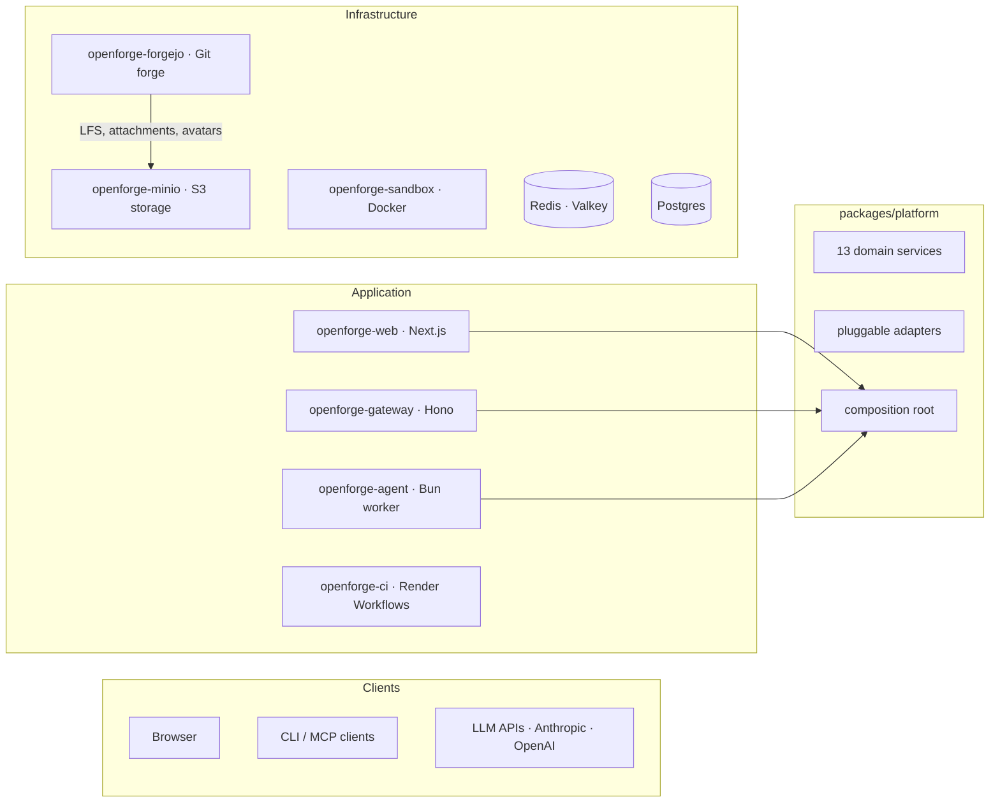

# OpenForge

An open-source, self-hosted coding agent and git forge you deploy and own entirely. Repository hosting, pull requests, CI runners, and an AI coding agent on your infrastructure — no per-seat fees.

Built on Forgejo, a Bun-based agent worker, **Render Workflows for CI execution**, and Render's infrastructure primitives.

## What it replaces

| Capability | Typical stack | OpenForge |
|---|---|---|
| Repository hosting | GitHub/GitLab ($4–21/user/mo) | Forgejo (self-hosted, $0/user) |
| AI coding agent | Cursor Business ($40/user/mo + token markup) | Built-in agent (pay only for LLM API tokens at cost) |
| CI/CD | GitHub Actions / GitLab CI (per-minute billing) | Forgejo workflow YAML + **Render Workflows** (flat worker cost) |
| Code review | Built into GitHub/GitLab | Built into Forgejo + agent-assisted review |
| Data ownership | Vendor-hosted | Postgres you control |

## Architecture

A four-tier system with a pluggable, service-oriented core:



### Application tier

| Service | Role |
|---|---|
| **openforge-web** | Next.js 15 app serving auth (NextAuth), chat UI, SSE streaming, and the forge browser. Route handlers are thin adapters that delegate to platform services. Port 4000. |
| **openforge-gateway** | Lightweight Hono server exposing all platform operations via REST, SSE, and MCP (Model Context Protocol). Runs headlessly — no browser required. OpenAPI docs at `/api/docs/ui`. Port 4100. |
| **openforge-agent** | Persistent Bun worker. Reads jobs from Redis Streams, runs multi-step LLM execution (AI SDK) with tool use, streams results back via the platform event bus. |
| **openforge-ci** | Render Workflows task worker. Clones repos, runs CI shell steps, posts results back to the web app. |

### Infrastructure tier

| Service | Role |
|---|---|
| **openforge-forgejo** | Forgejo running as a private service. Repos, PRs, code review, branch protection, orgs, CI workflow definitions. |
| **openforge-sandbox** | Isolated Docker container (no public IP, bearer-token auth). Filesystem, shell, git, and search over an internal HTTP API. |
| **openforge-minio** | S3-compatible object storage (MinIO). Forgejo stores LFS objects, attachments, avatars, packages, and repo archives here. Swappable for AWS S3 or any S3-compatible service. |
| **Postgres** | All application state via Drizzle ORM (single shared schema in `packages/db`). |
| **Redis (Valkey)** | Job queue (Streams), Pub/Sub for SSE event fan-out, cache, worker heartbeats. |

---

## Platform layer (`packages/platform`)

The core of the system is a framework-agnostic service layer. Every app — web, gateway, agent — creates one `PlatformContainer` at startup and uses the same typed services. No app contains business logic directly; route handlers are thin adapters.

### Composition root

```typescript
import Redis from "ioredis";
import { createPlatform } from "@openforge/platform/container";

const platform = createPlatform({
  databaseUrl: process.env.DATABASE_URL!,
  redis: new Redis(process.env.REDIS_URL!),
  // Optional overrides:
  // storage: new S3StorageAdapter(config),
  // cache: new MemoryCacheAdapter(),
  // ciDispatcher: new NoopCIDispatcher(),
  // notificationSink: new WebhookSink(url),
  // authProvider: new StaticTokenAuthProvider(tokens),
});

// Use in any route handler:
const { sessionId } = await platform.sessions.create(auth, params);
const models = await platform.models.listModels(auth);
```

Two factory functions:
- **`createPlatform(config)`** — Takes a database URL + Redis instance. Builds all adapters and services. Use in standalone processes (gateway, agent).
- **`createPlatformFromInstances(inst)`** — Takes pre-built `db` + `redis`. Use when the host owns connection lifecycle (e.g., Next.js with HMR-safe singletons).

### Domain services (13)

Every service method takes an `AuthContext` as the first argument — a simple object with `userId`, `username`, `forgeToken`, and `isAdmin`. Auth is resolved at the edge (NextAuth session or API key) and threaded through.

| Service | Responsibility | Key methods |
|---|---|---|
| **SessionService** | Agent session lifecycle, message dispatch, run control | `create`, `sendMessage`, `stop`, `reply`, `archive`, `updatePhase`, `updateConfig`, `getSkills`, `updateSkills`, `handleSpecAction`, `generateAutoTitle`, `enqueueReviewJob`, `listCiEvents` |
| **RepoService** | Repository CRUD, file operations, branch protection, secrets | `importRepo`, `getFileContents`, `putFileContents`, `getAgentConfig`, `writeAgentConfig`, `listBranchProtections`, `setBranchProtection`, `deleteBranchProtection`, `listSecrets`, `setSecret`, `deleteSecret`, `getTestResults`, `listArtifacts`, `downloadArtifact`, `getJobLogs` |
| **PullRequestService** | PR lifecycle, comments, reviews | `createPullRequest`, `updatePullRequest`, `mergePullRequest`, `listComments`, `createComment`, `listReviews`, `submitReview`, `resolveComment` |
| **OrgService** | Organization CRUD, members, secrets, usage quotas | `listOrgs`, `createOrg`, `deleteOrg`, `listMembers`, `addMember`, `removeMember`, `listSecrets`, `setSecret`, `deleteSecret`, `getUsage` |
| **InboxService** | PR event inbox with read/dismiss tracking | `list`, `countUnread`, `markRead`, `dismiss` |
| **SettingsService** | Encrypted LLM API key management | `listApiKeys`, `createOrUpdateApiKey`, `updateApiKey`, `deleteApiKey` |
| **SkillService** | Agent skill resolution, installation, sync | `listSkills`, `installSkill`, `syncSkills`, `listRepoSkills` |
| **ModelService** | Available LLM model discovery | `listModels` |
| **NotificationService** | Aggregated notification feed | `list` |
| **InviteService** | User invitation lifecycle | `listInvites`, `createInvite`, `acceptInvite` |
| **MirrorService** | GitHub/GitLab repo mirroring | `list`, `create`, `sync`, `delete`, `resolveConflict` |
| **CIService** | CI result ingestion, workflow dispatch | `handleResult`, `dispatchForEvent`, `enqueueSessionTriggerJob` |
| **WebhookService** | Forgejo/GitHub/GitLab webhook routing | `handleForgejoWebhook`, `handleGithubWebhook`, `handleGitlabWebhook` |

### Pluggable adapters

Infrastructure concerns are abstracted behind interfaces. Default implementations use Redis and Render, but any can be swapped at construction time.

| Interface | Default implementation | Purpose |
|---|---|---|
| **`QueueAdapter`** | `RedisQueueAdapter` (Redis Streams) | Agent job queue: `ensureGroup()`, `enqueue(job)` |
| **`EventBus`** | `RedisEventBus` (Streams + Pub/Sub) | Real-time run streaming, KV state, history replay |
| **`CacheAdapter`** | `RedisCacheAdapter` | Generic get/set/del cache with `getOrSet` helper |
| **`StorageAdapter`** | *(optional, not auto-filled)* | S3-shaped object store: `put`, `get`, `delete`, `list`, `getSignedUrl` |
| **`CIDispatcher`** | `RenderWorkflowsDispatcher` | Dispatch CI jobs to Render Workflows |
| **`NotificationSink`** | `ConsoleSink` | Deliver user notifications (also: `WebhookSink`, `CompositeSink`, `NoopSink`) |
| **`AuthProvider`** | *(optional, not auto-filled)* | Map bearer token → `AuthContext` (also: `StaticTokenAuthProvider`, `CompositeAuthProvider`) |

Additional built-in variants for testing: `MemoryCacheAdapter`, `NoopCIDispatcher`.

---

## Repo layout

```
apps/
  web/                   Next.js 15: auth, sessions, chat UI, forge browser, SSE (port 4000)
  gateway/               Hono headless API: REST, SSE, MCP, OpenAPI docs (port 4100)
  agent/                 Agent worker: LLM tools, skills, subagents, Redis Streams consumer
  ci-runner/             Render Workflows task worker: clone, run CI steps, POST results

packages/
  platform/              Framework-agnostic service layer: 13 services, pluggable adapters,
                         composition root. Subpath exports: ./container, ./forge, ./auth,
                         ./services, ./interfaces
  db/                    Shared Drizzle ORM schema (users, sessions, agent_runs, chats,
                         chat_messages, specs, ci_events, mirrors, pr_events, llm_api_keys,
                         invites, skill_cache, usage_events, …)
  shared/                Cross-cutting: error hierarchy, logger, API types, model catalog,
                         CI result parsers (JUnit XML, TAP). Browser-safe subset via ./client
  skills/                Skill markdown pipeline: builtins, resolve, install, provisioning
  sandbox/               SandboxAdapter interface + HTTP provider, session tokens, security audit
  ui/                    Shared React components, hooks, utilities

infrastructure/
  forgejo/               Forgejo Dockerfile + app.ini config + setup script
  minio/                 MinIO Dockerfile + entrypoint (S3-compatible object storage)
  runner/                Legacy Forgejo Actions runner image (optional)
```

---

## MCP & headless usage

The gateway exposes all platform operations via the [Model Context Protocol](https://modelcontextprotocol.io). Connect any MCP-compatible client (Claude Desktop, Cursor, custom agents) or call the REST API directly.

### MCP client configuration

```json
{
  "mcpServers": {
    "forge": {
      "url": "https://<gateway-host>/mcp",
      "headers": { "Authorization": "Bearer <GATEWAY_API_SECRET>" }
    }
  }
}
```

### Available MCP tools

| Group | Tools |
|---|---|
| **Sessions** | `create-session`, `send-message`, `reply-to-agent`, `stop-session`, `archive-session`, `list-ci-events` |
| **Repos** | `import-repo`, `get-file-contents`, `put-file-contents`, `get-agent-config`, `list-repo-secrets`, `get-test-results` |
| **Pull Requests** | `create-pull-request`, `merge-pull-request`, `list-pr-comments`, `create-pr-comment`, `submit-pr-review` |
| **Orgs** | `list-orgs`, `create-org`, `list-org-members`, `get-usage` |
| **Skills** | `list-skills`, `install-skill`, `sync-skills` |
| **Inbox** | `list-inbox`, `inbox-count`, `dismiss-inbox` |
| **Mirrors** | `list-mirrors`, `sync-mirror` |
| **Models** | `list-models` |

Transport: Streamable HTTP (web-standard variant). Sessions are tracked via the `mcp-session-id` response header.

OpenAPI docs: `GET http://localhost:4100/api/docs` (JSON spec) or `/api/docs/ui` (Swagger UI).

See [`apps/gateway/README.md`](apps/gateway/README.md) for the full endpoint reference.

---

## Local development

Infrastructure (Postgres, Redis, Forgejo, MinIO, sandbox) runs in Docker. The web app and agent worker run natively for hot reload.

### 1. Clone and install

```bash
git clone https://github.com/your-org/openforge.git
cd openforge
bun install
```

### 2. Start infrastructure

```bash
bun run infra:up
```

Starts Postgres (5433), Redis (6380), Forgejo (`http://localhost:3000`), MinIO (`http://localhost:9001`, credentials `minioadmin`/`minioadmin`), and the sandbox.

### 3. Run first-time Forgejo setup

After Forgejo is healthy, create the admin user in the Forgejo UI at `http://localhost:3000`, then provision the agent service account:

```bash
bun run setup
```

This creates the `openforge-agent` service account and generates API tokens. Copy the output values into your environment.

### 4. Configure environment

There's a single `.env` at the **repo root**. The per-package locations Next.js and the worker expect — `apps/web/.env`, `apps/web/.env.local`, and `apps/agent/.env` — are symlinks back to it. Edit the root file once; every process picks up the change.

```bash
cp .env.example .env
# then fill in the values from the setup script output
```

Key variables:

| Variable | Notes |
|---|---|
| `AUTH_SECRET` | Generate with `openssl rand -base64 32` |
| `ADMIN_EMAIL` | Email for the first admin account |
| `ADMIN_PASSWORD` | Password for the first admin account |
| `ANTHROPIC_API_KEY` | Required — at least one LLM provider key |
| `FORGEJO_AGENT_TOKEN` | From setup script |
| `FORGEJO_SANDBOX_URL` | `http://forgejo:3000` (hostname the sandbox container uses to reach Forgejo) |
| `CI_RUNNER_MODE` | `local` for dev (runs CI on your host); `render` + `RENDER_API_KEY` for remote |
| `CI_RUNNER_SECRET` | Shared secret for `POST /api/ci/results` |
| `GATEWAY_API_SECRET` | Bearer token for headless gateway auth |

See [`docs/environment.md`](docs/environment.md) for the full variable reference.

### 5. Push the database schema

```bash
bun run db:push
```

### 6. Start the app and worker

```bash
bun run dev
```

Starts Next.js on `http://localhost:4000` and the agent worker side by side via Turborepo. Sign in with your `ADMIN_EMAIL` / `ADMIN_PASSWORD` credentials (auto-created on first startup).

### 7. (Optional) Start the headless gateway

```bash
bun run gateway
```

Starts the Hono gateway on `http://localhost:4100`. Authenticate with `Authorization: Bearer <GATEWAY_API_SECRET>`. OpenAPI docs at `http://localhost:4100/api/docs/ui`.

### Useful commands

```bash
bun run infra:logs     # tail Docker service logs
bun run infra:down     # stop containers (data volumes preserved)
bun run db:studio      # Drizzle Studio on http://localhost:4983
bun run typecheck      # check all packages
bun run test           # run tests
bun run gateway        # start headless API gateway
```

---

## Deploy to Render

The `render.yaml` blueprint provisions all services shown in the architecture diagram. Fork this repo, then:

### 1. Provision the blueprint

Go to [render.com/new/blueprint](https://render.com/new/blueprint) and connect your fork.

### 2. Set environment variables

After provisioning, set these in the Render dashboard:

| Variable | Service(s) | Notes |
|---|---|---|
| `AUTH_SECRET` | Web | NextAuth encryption key. Generate with `openssl rand -base64 32` |
| `ADMIN_EMAIL` | Web | Email for the auto-bootstrapped admin account |
| `ADMIN_PASSWORD` | Web | Password for the auto-bootstrapped admin account |
| `ANTHROPIC_API_KEY` | Web, Agent | At least one LLM provider key |
| `RENDER_API_KEY` | Web | Render Dashboard API key for `render.workflows.startTask` |
| `SANDBOX_SHARED_SECRET` | Web, Agent, Sandbox | Same value on all three. Generate with `openssl rand -hex 32` |
| `FORGEJO_EXTERNAL_URL` | Web | Public URL of your Forgejo instance |
| `FORGEJO_AGENT_TOKEN` | Web, Agent, openforge-ci | Same token across all three |
| `CI_CALLBACK_URL` | Web (optional) | Public `https://<web>/api/ci/results` if the worker cannot reach the default internal URL |

`CI_RUNNER_SECRET` is auto-generated on **openforge-web** and linked into **openforge-ci** via Blueprint `fromService`. Both services must share this value for callbacks to authenticate.

### 3. Run Forgejo setup

Once Forgejo is live, create the Forgejo admin user through its UI, then run the setup script from a Render Shell on the web service:

```bash
bun run setup
```

### 4. Push the database schema

```bash
DATABASE_URL="<external-url>?sslmode=require" bun run db:push
```

### 5. Redeploy all services

After setting secrets, redeploy so services pick up the new env vars.

### 6. Verify

- `https://<web-url>/api/health` → `{"status":"healthy","checks":{"postgres":{"status":"ok"},"redis":{"status":"ok"},"forgejo":{"status":"ok"}}}`
- Sign in with your admin email and password
- `https://<web-url>/api/health/workers` → `{"hasActiveWorkers": true}`
- Confirm **openforge-ci** worker is **Live** in the Render dashboard

---

## Estimated cost

Infrastructure cost is flat and doesn't scale with headcount.

| Component | Render plan | Est. cost |
|---|---|---|
| Web app (Next.js) | Starter | $7 |
| Gateway (Hono) | Starter | $7 |
| Agent worker | Starter | $7 |
| Sandbox (Docker) | Standard + 20 GB disk | ~$29 |
| Forgejo (git forge) | Standard + 10 GB disk | ~$27 |
| MinIO (object storage) | Starter + 20 GB disk | ~$12 |
| CI worker (Render Workflows) | Starter | $7 |
| Redis | Starter | $10 |
| Postgres | Basic 256 MB | $7 |
| **Infrastructure total** | | **~$113/mo** |

LLM costs (Anthropic / OpenAI) depend on usage. A team of 10 engineers averaging 20 agent sessions/day typically runs $200–400/mo in API tokens.

**Comparison at different team sizes:**

| Team size | Cursor Business + GitHub + Actions* | OpenForge |
|---|---|---|
| 5 engineers | ~$270/mo | ~$213/mo (infra + ~$100 LLM) |
| 20 engineers | ~$1,080/mo | ~$413/mo (infra + ~$300 LLM) |
| 50 engineers | ~$2,700/mo | ~$713/mo (infra + ~$600 LLM) |
| 100 engineers | ~$5,400/mo | ~$1,113/mo (infra + ~$1,000 LLM) |

<sub>*Cursor Business ($40/user) + GitHub Team ($4/user) + Actions (~$10/user for moderate CI). Cursor's seat price includes limited fast requests; heavy agentic usage burns through the included quota. OpenForge calls LLM providers at cost with your own API keys.</sub>

---

## Object storage

Forgejo's blob storage (LFS objects, attachments, avatars, packages, repo-archives) is backed by MinIO.

**Swapping to managed S3:** Change `FORGEJO__storage__MINIO_ENDPOINT` to your S3-compatible provider, set `MINIO_USE_SSL=true`, and supply the appropriate credentials. No code or Dockerfile changes needed.

**What stays on local disk:** Git bare repositories (`/data/git/repositories/`) remain on Forgejo's persistent disk. Git requires POSIX filesystem access. Back up via scheduled mirror pushes or volume snapshots.

See [`docs/environment.md`](docs/environment.md) for the full list of MinIO and Forgejo storage environment variables.

---

## Documentation

The `docs/` directory has long-form material. Each app and package also has its own README.

- [`docs/architecture.md`](docs/architecture.md) — Authentication, architectural decisions, Forgejo, skills system, data ownership
- [`docs/capabilities.md`](docs/capabilities.md) — Agent tools, skills, mirroring, CI reactions, web UI, persistence, org quotas
- [`docs/environment.md`](docs/environment.md) — Environment variable reference for all services
- [`docs/e2e-agent-test.md`](docs/e2e-agent-test.md) — End-to-end test plan covering all API endpoints, MCP, agent workflows
- [`apps/gateway/README.md`](apps/gateway/README.md) — Headless API endpoint reference, MCP tools, SSE streams

---

## Future work

- Per-user API key authentication on the gateway (currently admin-only shared secret)
- Tune Render Workflows concurrency, timeouts, and plans per repo or workflow
- Enhanced spec-driven development with approval gates and inline spec editing
- External integrations (Slack notifications, webhook triggers)
- Per-team usage dashboards and LLM cost attribution
- VM-level sandbox isolation for untrusted workloads

## License

Open source. See [LICENSE](./LICENSE) for details.
