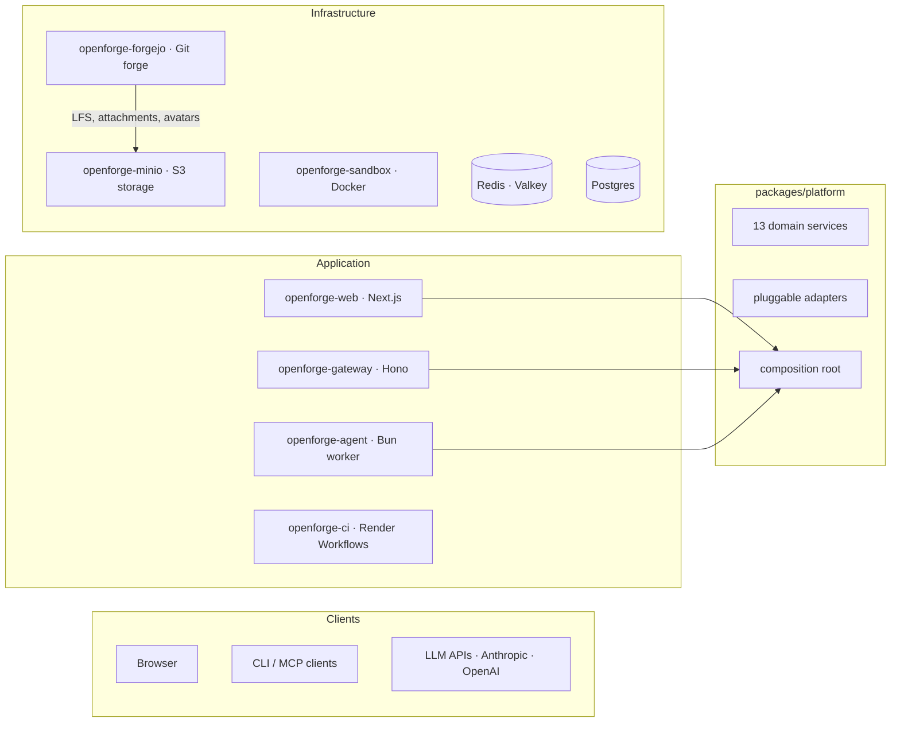

# OpenForge

OpenForge is a full-stack coding agent platform and git forge you deploy and own entirely. The web app, headless API gateway, agent workers, CI runners, sandbox, and databases run on infrastructure you can inspect, query, and replace — a Postgres database, a Redis instance, Docker containers, and long-running processes. Nothing proprietary between you and your data.

## What it is

A four-layer system:

- The **web app** handles authentication, sessions, chat history, streaming UI, the forge browser (repos, PRs, code review), and delegates all business logic to the platform layer.
- The **gateway** is a headless Hono server exposing all platform operations via REST, SSE, and MCP (Model Context Protocol). Connect any MCP-compatible client — Claude Desktop, Cursor, custom agents — or call the REST API directly.
- The **agent worker** is a persistent Bun process that reads jobs from a Redis Streams queue, drives multi-step LLM execution with tool use, persists results, and streams events back to the browser.
- The **CI runner** clones repos, runs CI shell steps defined in Forgejo workflow YAML, and posts results back to the platform.
- The **infrastructure tier** — Forgejo (git forge), a sandboxed Docker execution environment, MinIO (S3-compatible storage), Postgres, and Redis — provides the durable backing services.



## Repo layout

```
apps/
  web/                   Next.js 15: auth, sessions, chat UI, forge browser, SSE (port 4000)
  gateway/               Hono headless API: REST, SSE, MCP, OpenAPI docs (port 4100)
  agent/                 Agent worker: LLM tools, skills, subagents, Redis Streams consumer
  ci-runner/             Render Workflows task worker: clone, run CI steps, POST results

packages/
  platform/              Framework-agnostic service layer: 13 services, pluggable adapters,
                         composition root, ForgeProvider abstraction (Forgejo/GitHub/GitLab)
  db/                    Shared Drizzle ORM schema
  shared/                Error hierarchy, logger, API types, model catalog, CI result parsers
  skills/                Skill markdown pipeline: builtins, resolve, install, provisioning
  sandbox/               SandboxAdapter interface + HTTP provider
  ui/                    Shared React components, hooks, utilities

infrastructure/
  forgejo/               Forgejo Dockerfile + app.ini config + setup script
  minio/                 MinIO Dockerfile + entrypoint (S3-compatible object storage)
  runner/                Legacy Forgejo Actions runner image (optional)
```

## Local development

Infrastructure (Postgres, Redis, Forgejo, MinIO, sandbox) runs in Docker. The web app and agent worker run natively for hot reload.

### 1. Clone and install

```bash
git clone https://github.com/render-oss/render-open-forge.git
cd render-open-forge
bun install
```

### 2. Start infrastructure

```bash
bun run infra:up
```

Starts Postgres (5433), Redis (6380), Forgejo (`http://localhost:3000`), MinIO (`http://localhost:9001`, credentials `minioadmin`/`minioadmin`), and the sandbox.

### 3. Run first-time Forgejo setup

After Forgejo is healthy, create the admin user in the Forgejo UI at `http://localhost:3000`, then provision the agent service account:

```bash
bun run setup
```

This creates the `openforge-agent` service account and generates API tokens. Copy the output values into your environment.

### 4. Configure environment

There's a single `.env` at the **repo root**. The per-package locations Next.js and the worker expect — `apps/web/.env`, `apps/web/.env.local`, and `apps/agent/.env` — are symlinks back to it. Edit the root file once; every process picks up the change.

```bash
cp .env.example .env
# then fill in the values from the setup script output
```

Key variables:

| Variable | Notes |
|---|---|
| `AUTH_SECRET` | Generate with `openssl rand -base64 32` |
| `ADMIN_EMAIL` | Email for the first admin account |
| `ADMIN_PASSWORD` | Password for the first admin account |
| `ANTHROPIC_API_KEY` | Required — at least one LLM provider key |
| `FORGEJO_AGENT_TOKEN` | From setup script |
| `FORGEJO_SANDBOX_URL` | `http://forgejo:3000` (hostname the sandbox container uses to reach Forgejo) |
| `CI_RUNNER_MODE` | `local` for dev (runs CI on your host); `render` + `RENDER_API_KEY` for remote |
| `CI_RUNNER_SECRET` | Shared secret for `POST /api/ci/results` |
| `GATEWAY_API_SECRET` | Bearer token for headless gateway auth |

See [`docs/environment.md`](docs/environment.md) for the full variable reference.

### 5. Push the database schema

```bash
bun run db:push
```

### 6. Start the app and worker

```bash
bun run dev
```

Starts Next.js on `http://localhost:4000` and the agent worker side by side via Turborepo. Sign in with your `ADMIN_EMAIL` / `ADMIN_PASSWORD` credentials (auto-created on first startup).

### 7. (Optional) Start the headless gateway

```bash
bun run gateway
```

Starts the Hono gateway on `http://localhost:4100`. Authenticate with `Authorization: Bearer <GATEWAY_API_SECRET>`. OpenAPI docs at `http://localhost:4100/api/docs/ui`.

### Useful commands

```bash
bun run infra:logs     # tail Docker service logs
bun run infra:down     # stop containers (data volumes preserved)
bun run db:studio      # Drizzle Studio on http://localhost:4983
bun run typecheck      # check all packages
bun run test           # run tests
bun run gateway        # start headless API gateway
```

## Deploy to Render

The `render.yaml` blueprint provisions all services shown in the architecture diagram. Fork this repo, then:

### 1. Provision the blueprint

Go to [render.com/new/blueprint](https://render.com/new/blueprint) and connect your fork. This creates all services, databases, and wires up auto-generated secrets and cross-service references.

The following are handled automatically by the blueprint (no action needed):

- `DATABASE_URL`, `REDIS_URL` — wired from the database and key-value store
- `AUTH_SECRET`, `CSRF_SECRET`, `ENCRYPTION_KEY`, `CI_RUNNER_SECRET` — auto-generated on `openforge-web`
- `GATEWAY_API_SECRET` — auto-generated on `openforge-gateway`
- `SANDBOX_SHARED_SECRET`, `SANDBOX_SESSION_SECRET` — auto-generated on sandbox, shared with agent via `fromService`
- `MINIO_ROOT_USER`, `MINIO_ROOT_PASSWORD` — auto-generated on MinIO, shared with Forgejo via `fromService`
- `FORGEJO_SANDBOX_URL` — hardcoded internal URL on agent
- All other `fromService` references (e.g. `ENCRYPTION_KEY` on agent/gateway pulls from web)

### 2. Set pre-deploy environment variables

Set these on `openforge-web` immediately after provisioning. Replace `<web-url>` with the public URL Render assigns to `openforge-web` (e.g. `https://openforge-web-xxxx.onrender.com`).

| Variable | Set on | Value / source |
|---|---|---|
| `ANTHROPIC_API_KEY` | **openforge-web** + **openforge-agent** | Your [Anthropic](https://console.anthropic.com/) account |
| `RENDER_API_KEY` | **openforge-web** | Render Dashboard → Account Settings → API Keys |
| `AUTH_URL` | **openforge-web** | `https://<web-url>` (the web app's own public URL) |
| `NEXT_PUBLIC_APP_URL` | **openforge-web** | Same as `AUTH_URL` |
| `ADMIN_EMAIL` | **openforge-web** | Email for the auto-bootstrapped admin account |
| `ADMIN_PASSWORD` | **openforge-web** | Password for signing in to the web app |

### 3. Wait for Forgejo to boot

Forgejo takes ~10–15 seconds to initialize (DB migrations, storage setup). It may restart once or twice before the health check passes — this is normal.

Once it's live, note its public URL (e.g. `https://openforge-forgejo-xxxx.onrender.com`).

### 4. Set Forgejo URLs

| Variable | Set on | Value |
|---|---|---|
| `FORGEJO__server__ROOT_URL` | **openforge-forgejo** | Forgejo's public URL |
| `FORGEJO_EXTERNAL_URL` | **openforge-web** | Same Forgejo public URL |

Redeploy `openforge-forgejo` after setting `ROOT_URL`.

### 5. Create the Forgejo admin user

Open a **Shell** on the `openforge-forgejo` service in the Render Dashboard and run:

```bash
su -c 'forgejo admin user create --admin --username forge-admin --password <your-password> --email <your-email>' git
```

Must run as the `git` user — Forgejo refuses to run as root.

### 6. Run the Forgejo setup script

Run **locally** from your project root (it makes HTTP calls to Forgejo's public API):

```bash
FORGEJO_INTERNAL_URL=https://openforge-forgejo-xxxx.onrender.com \
FORGEJO_ADMIN_USER=forge-admin \
FORGEJO_ADMIN_PASSWORD=<your-password> \
FORGEJO_EXTERNAL_URL=https://openforge-web-xxxx.onrender.com \
bun run infrastructure/forgejo/setup.ts
```

The script will:
1. Create an `openforge-agent` service account and print a **`FORGEJO_AGENT_TOKEN`**
2. Register an OAuth2 app and print **`FORGEJO_OAUTH_CLIENT_ID`** and **`FORGEJO_OAUTH_CLIENT_SECRET`**

### 7. Set Forgejo-derived environment variables

Take the values from the setup script output and set them in the Render Dashboard:

| Variable | Set on |
|---|---|
| `FORGEJO_AGENT_TOKEN` | **openforge-web** + **openforge-agent** + **openforge-gateway** |
| `FORGEJO_OAUTH_CLIENT_ID` | **openforge-web** |
| `FORGEJO_OAUTH_CLIENT_SECRET` | **openforge-web** |

### 8. Set remaining variables

| Variable | Set on | Value |
|---|---|---|
| `CI_CALLBACK_URL` | **openforge-web** | `https://<web-url>/api/ci/callback` |
| `FORGEJO_WEBHOOK_SECRET` | **openforge-gateway** | Any strong random string (e.g. `openssl rand -hex 32`), then configure the same value in Forgejo's webhook settings |

### 9. Set up CI (Render Workflows)

Render Workflows can't be defined in Blueprints yet, so create the CI workflow manually:

1. Go to the Render Dashboard → **Workflows** → **New Workflow**
2. Connect your repo, set the root directory to `apps/ci-runner`
3. Build command: `bun install && npx turbo build --filter=@openforge/ci-runner`
4. Set these env vars on the workflow:
   - `FORGEJO_INTERNAL_URL` = `http://openforge-forgejo:3000`
   - `FORGEJO_AGENT_TOKEN` = same token from step 7
   - `CI_RUNNER_SECRET` = copy from `openforge-web`

### 10. Push the database schema

Forgejo and OpenForge share the same database. Use `generate` + `migrate` instead of `db:push` to avoid Drizzle trying to drop Forgejo's tables:

```bash
cd apps/web
DATABASE_URL="<external-connection-string>?sslmode=require" npx drizzle-kit generate
DATABASE_URL="<external-connection-string>?sslmode=require" npx drizzle-kit migrate
```

Get the external connection string from the `openforge-db` database page in the Render Dashboard. Always choose **"create table"** (not rename) if prompted.

### 11. Bootstrap the admin user

This seeds the first admin user into the database and links it to the Forgejo admin account. Run **locally**:

```bash
DATABASE_URL="<external-connection-string>?sslmode=require" \
FORGEJO_INTERNAL_URL=https://openforge-forgejo-xxxx.onrender.com \
FORGEJO_AGENT_TOKEN=<your-agent-token> \
ADMIN_EMAIL=<your-email> \
ADMIN_PASSWORD=<your-web-login-password> \
FORGEJO_ADMIN_PASSWORD=<your-forgejo-admin-password> \
bun run apps/web/scripts/bootstrap-admin.ts
```

This is the password you'll use to sign in to the web app — it can be different from the Forgejo admin password.

### 12. Redeploy all services

After setting all secrets, redeploy every service so they pick up the new env vars.

### 13. Verify

- `https://<web-url>/api/health` → `{"status":"healthy","checks":{"postgres":{"status":"ok"},"redis":{"status":"ok"},"forgejo":{"status":"ok"}}}`
- Sign in at `https://<web-url>` with your `ADMIN_EMAIL` and `ADMIN_PASSWORD`
- `https://<web-url>/api/health/workers` → `{"hasActiveWorkers": true}`

### Optional: Google OAuth on Forgejo

To let users sign in to Forgejo via Google, set these on **openforge-forgejo**:

| Variable | Where to get it |
|---|---|
| `GOOGLE_OAUTH_CLIENT_ID` | [Google Cloud Console](https://console.cloud.google.com/apis/credentials) |
| `GOOGLE_OAUTH_CLIENT_SECRET` | Same |

## Documentation

The `docs/` directory has the detailed material:

- [`docs/architecture.md`](docs/architecture.md) — System design, platform layer, services, adapters, ForgeProvider, skills, auth, CI, data model
- [`docs/capabilities.md`](docs/capabilities.md) — Agent tools, skills, mirroring, CI reactions, streaming, operations
- [`docs/environment.md`](docs/environment.md) — Environment variable reference for all services
- [`apps/gateway/README.md`](apps/gateway/README.md) — Headless API endpoint reference, MCP tools, SSE streams

## License

Open source. See [LICENSE](./LICENSE) for details.
