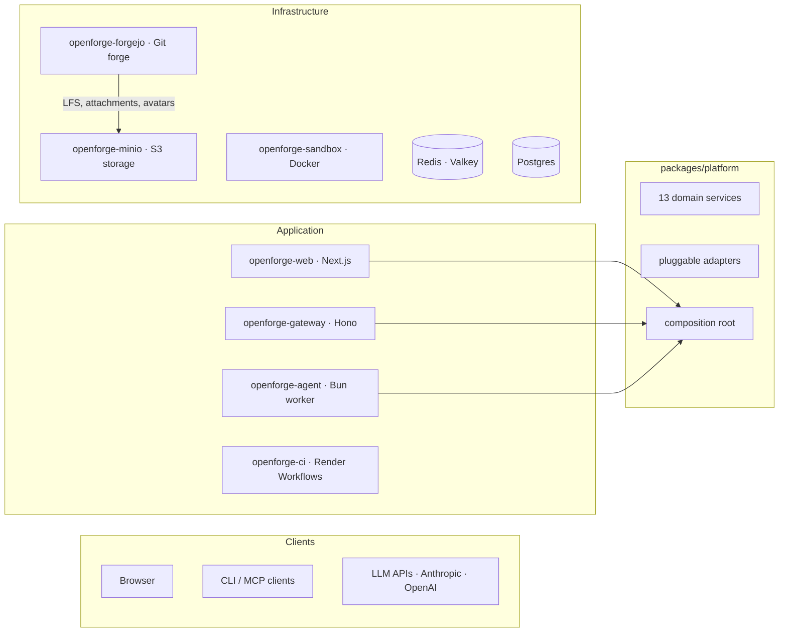

# OpenForge

OpenForge is a full-stack coding agent platform and git forge you deploy and own entirely. The web app, headless API gateway, agent workers, CI runners, sandbox, and databases run on infrastructure you can inspect, query, and replace — a Postgres database, a Redis instance, Docker containers, and long-running processes. Nothing proprietary between you and your data.

## What it is

A four-layer system:

- The **web app** handles authentication, sessions, chat history, streaming UI, the forge browser (repos, PRs, code review), and delegates all business logic to the platform layer.
- The **gateway** is a headless Hono server exposing all platform operations via REST, SSE, and MCP (Model Context Protocol). Connect any MCP-compatible client — Claude Desktop, Cursor, custom agents — or call the REST API directly.
- The **agent worker** is a persistent Bun process that reads jobs from a Redis Streams queue, drives multi-step LLM execution with tool use, persists results, and streams events back to the browser.
- The **CI runner** clones repos, runs CI shell steps defined in Forgejo workflow YAML, and posts results back to the platform.
- The **infrastructure tier** — Forgejo (git forge), a sandboxed Docker execution environment, MinIO (S3-compatible storage), Postgres, and Redis — provides the durable backing services.



### Separation of concerns

The agent does not run inside the execution environment. It runs alongside it and interacts through tools — file read/write, shell execution, grep, git, glob — over an internal HTTP API. The sandbox has no knowledge of the agent protocol or model being used. The two can be scaled, replaced, and debugged independently.

No application service contains business logic directly. All three apps (web, gateway, agent) create one `PlatformContainer` at startup and use the same typed service layer. Route handlers are thin adapters.

## Repo layout

```
apps/
  web/                   Next.js 15: auth, sessions, chat UI, forge browser, SSE (port 4000)
  gateway/               Hono headless API: REST, SSE, MCP, OpenAPI docs (port 4100)
  agent/                 Agent worker: LLM tools, skills, subagents, Redis Streams consumer
  ci-runner/             Render Workflows task worker: clone, run CI steps, POST results

packages/
  platform/              Framework-agnostic service layer: 13 services, pluggable adapters,
                         composition root, ForgeProvider abstraction (Forgejo/GitHub/GitLab)
  db/                    Shared Drizzle ORM schema
  shared/                Error hierarchy, logger, API types, model catalog, CI result parsers
  skills/                Skill markdown pipeline: builtins, resolve, install, provisioning
  sandbox/               SandboxAdapter interface + HTTP provider
  ui/                    Shared React components, hooks, utilities

infrastructure/
  forgejo/               Forgejo Dockerfile + app.ini config + setup script
  minio/                 MinIO Dockerfile + entrypoint (S3-compatible object storage)
  runner/                Legacy Forgejo Actions runner image (optional)
```

## Local development

Infrastructure (Postgres, Redis, Forgejo, MinIO, sandbox) runs in Docker. The web app and agent worker run natively for hot reload.

### 1. Clone and install

```bash
git clone https://github.com/render-oss/render-open-forge.git
cd render-open-forge
bun install
```

### 2. Start infrastructure

```bash
bun run infra:up
```

Starts Postgres (5433), Redis (6380), Forgejo (`http://localhost:3000`), MinIO (`http://localhost:9001`, credentials `minioadmin`/`minioadmin`), and the sandbox.

### 3. Run first-time Forgejo setup

After Forgejo is healthy, create the admin user in the Forgejo UI at `http://localhost:3000`, then provision the agent service account:

```bash
bun run setup
```

This creates the `openforge-agent` service account and generates API tokens. Copy the output values into your environment.

### 4. Configure environment

There's a single `.env` at the **repo root**. The per-package locations Next.js and the worker expect — `apps/web/.env`, `apps/web/.env.local`, and `apps/agent/.env` — are symlinks back to it. Edit the root file once; every process picks up the change.

```bash
cp .env.example .env
# then fill in the values from the setup script output
```

Key variables:

| Variable | Notes |
|---|---|
| `AUTH_SECRET` | Generate with `openssl rand -base64 32` |
| `ADMIN_EMAIL` | Email for the first admin account |
| `ADMIN_PASSWORD` | Password for the first admin account |
| `ANTHROPIC_API_KEY` | Required — at least one LLM provider key |
| `FORGEJO_AGENT_TOKEN` | From setup script |
| `FORGEJO_SANDBOX_URL` | `http://forgejo:3000` (hostname the sandbox container uses to reach Forgejo) |
| `CI_RUNNER_MODE` | `local` for dev (runs CI on your host); `render` + `RENDER_API_KEY` for remote |
| `CI_RUNNER_SECRET` | Shared secret for `POST /api/ci/results` |
| `GATEWAY_API_SECRET` | Bearer token for headless gateway auth |

See [`docs/environment.md`](docs/environment.md) for the full variable reference.

### 5. Push the database schema

```bash
bun run db:push
```

### 6. Start the app and worker

```bash
bun run dev
```

Starts Next.js on `http://localhost:4000` and the agent worker side by side via Turborepo. Sign in with your `ADMIN_EMAIL` / `ADMIN_PASSWORD` credentials (auto-created on first startup).

### 7. (Optional) Start the headless gateway

```bash
bun run gateway
```

Starts the Hono gateway on `http://localhost:4100`. Authenticate with `Authorization: Bearer <GATEWAY_API_SECRET>`. OpenAPI docs at `http://localhost:4100/api/docs/ui`.

### Useful commands

```bash
bun run infra:logs     # tail Docker service logs
bun run infra:down     # stop containers (data volumes preserved)
bun run db:studio      # Drizzle Studio on http://localhost:4983
bun run typecheck      # check all packages
bun run test           # run tests
bun run gateway        # start headless API gateway
```

## Deploy to Render

The `render.yaml` blueprint provisions all services shown in the architecture diagram. Fork this repo, then:

### 1. Provision the blueprint

Go to [render.com/new/blueprint](https://render.com/new/blueprint) and connect your fork.

### 2. Set environment variables

After provisioning, set these in the Render dashboard:

| Variable | Service(s) | Notes |
|---|---|---|
| `AUTH_SECRET` | Web | NextAuth encryption key. Generate with `openssl rand -base64 32` |
| `ADMIN_EMAIL` | Web | Email for the auto-bootstrapped admin account |
| `ADMIN_PASSWORD` | Web | Password for the auto-bootstrapped admin account |
| `ANTHROPIC_API_KEY` | Web, Agent | At least one LLM provider key |
| `RENDER_API_KEY` | Web | Render Dashboard API key for `render.workflows.startTask` |
| `SANDBOX_SHARED_SECRET` | Web, Agent, Sandbox | Same value on all three. Generate with `openssl rand -hex 32` |
| `FORGEJO_EXTERNAL_URL` | Web | Public URL of your Forgejo instance |
| `FORGEJO_AGENT_TOKEN` | Web, Agent, openforge-ci | Same token across all three |
| `CI_CALLBACK_URL` | Web (optional) | Public `https://<web>/api/ci/results` if the worker cannot reach the default internal URL |

`CI_RUNNER_SECRET` is auto-generated on **openforge-web** and linked into **openforge-ci** via Blueprint `fromService`. Both services must share this value for callbacks to authenticate.

### 3. Run Forgejo setup

Once Forgejo is live, create the Forgejo admin user through its UI, then run the setup script from a Render Shell on the web service:

```bash
bun run setup
```

### 4. Push the database schema

```bash
DATABASE_URL="<external-url>?sslmode=require" bun run db:push
```

### 5. Redeploy all services

After setting secrets, redeploy so services pick up the new env vars.

### 6. Verify

- `https://<web-url>/api/health` → `{"status":"healthy","checks":{"postgres":{"status":"ok"},"redis":{"status":"ok"},"forgejo":{"status":"ok"}}}`
- Sign in with your admin email and password
- `https://<web-url>/api/health/workers` → `{"hasActiveWorkers": true}`
- Confirm **openforge-ci** worker is **Live** in the Render dashboard

## Documentation

The `docs/` directory has the detailed material:

- [`docs/architecture.md`](docs/architecture.md) — System design, platform layer, services, adapters, ForgeProvider, skills, auth, CI, data model
- [`docs/capabilities.md`](docs/capabilities.md) — Agent tools, skills, mirroring, CI reactions, streaming, operations
- [`docs/environment.md`](docs/environment.md) — Environment variable reference for all services
- [`apps/gateway/README.md`](apps/gateway/README.md) — Headless API endpoint reference, MCP tools, SSE streams

## License

Open source. See [LICENSE](./LICENSE) for details.
