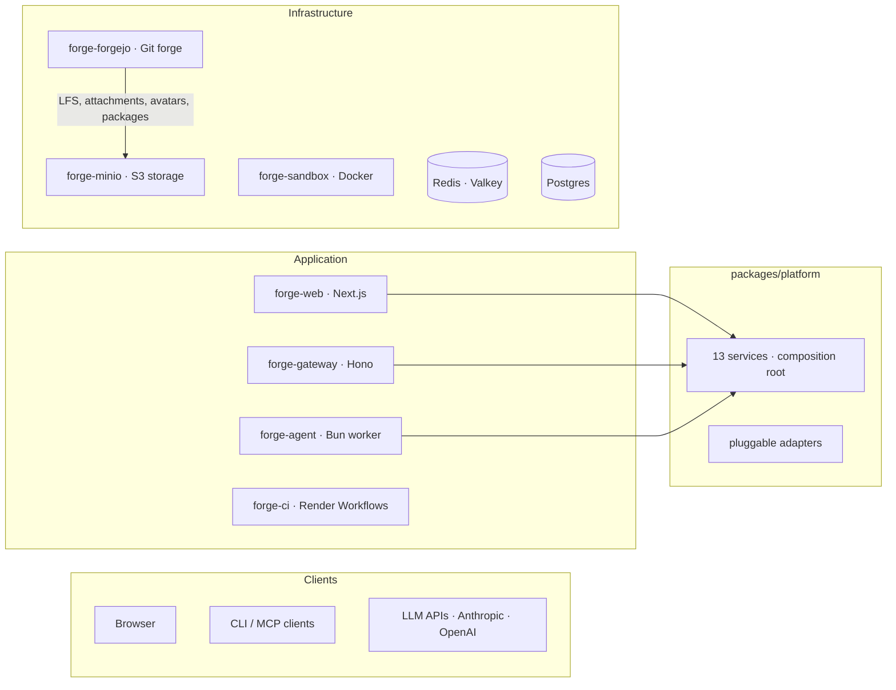

# OpenForge

An open-source self-hosted coding agent and git forge you deploy and own entirely. Repository hosting, pull requests, CI runners, and an AI coding agent on your infrastructure, with no per-seat fees.

Built on Forgejo, a Bun-based agent worker, **Render Workflows for CI execution**, and Render's infrastructure primitives.

## What it replaces

| Capability | Typical stack | render-open-forge |
|---|---|---|
| Repository hosting | GitHub/GitLab ($4–21/user/mo) | Forgejo (self-hosted, $0/user) |
| AI coding agent | Cursor Business ($40/user/mo + token markup) | Built-in agent (pay only for LLM API tokens at cost) |
| CI/CD | GitHub Actions / GitLab CI (per-minute billing) | Forgejo workflow YAML + **Render Workflows** execution (flat worker cost, scalable tasks) |
| Code review | Built into GitHub/GitLab | Built into Forgejo + agent-assisted review |
| Data ownership | Vendor-hosted | Postgres you control |

## Architecture

A four-tier system with a pluggable service layer:



- **forge-web**: Next.js app serving auth, chat UI, SSE streaming, and the forge browser. Route handlers are thin adapters calling platform services.
- **forge-gateway**: lightweight Hono server exposing all platform operations via REST, SSE, and MCP. Runs headlessly on port 4100 — no browser required. Includes OpenAPI docs at `/api/docs/ui`.
- **forge-agent**: persistent Bun worker. Reads jobs from Redis Streams, runs multi-step LLM execution via platform services, streams results back.
- **forge-ci**: Render Workflows task worker. Clones repos, runs CI shell steps, posts results to the web app.
- **forge-sandbox**: isolated Docker container (no public IP, bearer-token auth). Filesystem, shell, git, and search over an internal HTTP API.
- **forge-forgejo**: Forgejo running as a private service. Repos, PRs, code review, branch protection, orgs, CI workflow definitions.
- **forge-minio**: S3-compatible object storage (MinIO). Forgejo stores LFS objects, attachments, avatars, packages, and repo-archives here instead of local disk. Swappable for AWS S3 or any S3-compatible service.
- **packages/platform**: framework-agnostic service layer with 13 domain services, pluggable adapters (storage, cache, CI dispatcher, notification sink, auth provider), and a composition root. Every app creates one `PlatformContainer` at startup.
- **Postgres**: all application state via Drizzle ORM.
- **Redis (Valkey)**: job queue (Streams), Pub/Sub for SSE, cache, worker heartbeats.

## Repo layout

```
apps/
  web/                   Next.js 15 app: auth, sessions, chat UI, forge browser, SSE
  gateway/               Hono headless API: REST, SSE, MCP, OpenAPI docs (port 4100)
  agent/                 Agent worker: tools, skills, subagents, Redis consumer
  ci-runner/             Render Workflows task worker: clone, run steps, POST results

packages/
  platform/              Framework-agnostic service layer: 13 services, pluggable adapters, composition root
  db/                    Shared Drizzle ORM schema and migrations
  shared/                Shared types, errors, constants, stream events
  ui/                    Client-side React hooks and utilities
  skills/                Skill types, resolution, builtins, provisioning, parsing
  sandbox/               Sandbox HTTP adapter + Bun server + Docker image

infrastructure/
  forgejo/               Forgejo Dockerfile + app.ini config + setup script
  minio/                 MinIO Dockerfile + entrypoint (S3-compatible object storage)
  runner/                Legacy Forgejo Actions runner image (optional)
```

## Local development

Infrastructure (Postgres, Redis, Forgejo, sandbox) runs in Docker. The web app and agent worker run natively for hot reload. **CI** runs via the web app: set `CI_RUNNER_MODE=local` so `push` / `pull_request` webhooks execute workflow steps on your machine (requires `git` and `bash`), or point `CI_RUNNER_MODE` at Render and supply `RENDER_API_KEY` to dispatch remote tasks.

**1. Clone and install**

```bash
git clone https://github.com/your-org/render-open-forge.git
cd render-open-forge
bun install
```

**2. Start infrastructure**

```bash
bun run infra:up
```

This starts Postgres, Redis, Forgejo, MinIO, and the sandbox. Forgejo will be at `http://localhost:3000` (admin-only, end users don't need it). The MinIO console is at `http://localhost:9001` (credentials: `minioadmin` / `minioadmin`).

**3. Run first-time Forgejo setup**

After Forgejo is healthy, create the admin user in the Forgejo UI at `http://localhost:3000`, then provision the agent service account:

```bash
bun run setup
```

This creates the `forge-agent` service account and generates API tokens. Copy the output values into your environment.

**4. Configure environment**

There's a single `.env` at the **repo root**. The per-package locations Next.js
and the worker expect — `apps/web/.env`, `apps/web/.env.local`, and
`apps/agent/.env` — are symlinks back to it (already checked into the repo).
Edit the root file once; every process picks up the change.

```bash
cp .env.example .env
# then fill in the values
```

Fill in the values printed by the setup script, plus:

| Variable | Notes |
|---|---|
| `AUTH_SECRET` | Generate with `openssl rand -base64 32` |
| `ADMIN_EMAIL` | Email for the first admin account |
| `ADMIN_PASSWORD` | Password for the first admin account |
| `ANTHROPIC_API_KEY` | Required, at least one LLM provider key |
| `FORGEJO_AGENT_TOKEN` | From setup script, needed for CI clone URLs and forge API |
| `FORGEJO_SANDBOX_URL` | `http://forgejo:3000` — hostname the sandbox container uses to reach Forgejo |
| `CI_RUNNER_MODE` | `local` to run CI on your host (default dev); `render` + `RENDER_API_KEY` to dispatch Render Workflows |
| `CI_RUNNER_SECRET` | Shared secret for `POST /api/ci/results` (any dev string; must match if you run `forge-ci` locally) |
| `RENDER_API_KEY` | Required when `CI_RUNNER_MODE=render` |

**5. Push the database schema**

```bash
bun run db:push
```

**6. Start the app and worker**

```bash
bun run dev
```

This starts Next.js on `http://localhost:4000` and the agent worker side by side via Turborepo. Sign in with your `ADMIN_EMAIL` / `ADMIN_PASSWORD` credentials (auto-created on first startup).

**7. (Optional) Start the headless gateway**

```bash
bun run gateway
```

This starts the Hono gateway on `http://localhost:4100`. Authenticate with `Authorization: Bearer <GATEWAY_API_SECRET>`. OpenAPI docs are at `http://localhost:4100/api/docs/ui`.

### Useful commands

```bash
bun run infra:logs     # tail Docker service logs
bun run infra:down     # stop containers (data volumes preserved)
bun run db:studio      # Drizzle Studio on http://localhost:4983
bun run typecheck      # check all packages
bun run test           # run tests
bun run gateway        # start headless API gateway
```

## Deploy to Render

The `render.yaml` blueprint provisions all services shown in the architecture diagram. Fork this repo, then:

**1. Provision the blueprint**

Go to [render.com/new/blueprint](https://render.com/new/blueprint) and connect your fork.

**2. Set environment variables**

After provisioning, set these in the Render dashboard:

| Variable | Service(s) | Notes |
|---|---|---|
| `AUTH_SECRET` | Web | NextAuth encryption key. Generate with `openssl rand -base64 32` |
| `ADMIN_EMAIL` | Web | Email for the auto-bootstrapped admin account |
| `ADMIN_PASSWORD` | Web | Password for the auto-bootstrapped admin account |
| `ANTHROPIC_API_KEY` | Web, Agent | Required, at least one LLM provider key |
| `RENDER_API_KEY` | Web | Required for CI. Render Dashboard API key used to call **`render.workflows.startTask`** |
| `SANDBOX_SHARED_SECRET` | Web, Agent, Sandbox | Same value on all three. Generate with `openssl rand -hex 32` |
| `FORGEJO_EXTERNAL_URL` | Web | Public URL of your Forgejo instance |
| `FORGEJO_AGENT_TOKEN` | Web, Agent, **forge-ci** | Same token. CI clones and Forge HTTP API calls use this |
| `CI_CALLBACK_URL` | Web (optional) | Public **`https://<your-web-service>/api/ci/results`** if the worker cannot reach the default internal URL; otherwise omit |
| `RENDER_CI_WORKFLOW_SLUG` | Web | Optional, defaults to **`forge-ci`**. Must match the Workflow service slug shown in Render |

**Notes:** `CI_RUNNER_SECRET` is auto-generated on **`forge-web`** and linked into **`forge-ci`** via Blueprint `fromService`. Both services must share this value for callbacks to authenticate. Register Forgejo webhooks pointing at **`https://<web>/api/webhooks/forgejo`** (or your configured path) including **`push`** and **`pull_request`** events so CI dispatches fire.

**3. Run Forgejo setup**

Once Forgejo is live, create the Forgejo admin user through its UI (this is the infrastructure admin, separate from your OpenForge admin account), then run the setup script from a Render Shell on the web service:

```bash
bun run setup
```

Or run it locally against the external Forgejo URL:

```bash
FORGEJO_INTERNAL_URL="https://your-forgejo-url.onrender.com" bun run setup
```

**4. Push the database schema**

From your laptop using the external Postgres URL:

```bash
DATABASE_URL="<external-url>?sslmode=require" bun run db:push
```

Or from a Render Shell on the web service:

```bash
bun run db:push
```

**5. Redeploy all services**

After setting secrets, redeploy so services pick up the new env vars.

**6. Verify**

- `https://<web-url>/api/health` → `{"status":"ok","database":"ok","redis":"ok"}`
- Sign in with your admin email and password
- Check worker health: `https://<web-url>/api/health/workers` → `hasActiveWorkers: true`
- In the Render dashboard, confirm the **`forge-ci`** worker is **Live** (it registers Render Workflow tasks on startup)

## Estimated cost

Infrastructure cost is flat and doesn't scale with headcount.

| Component | Render plan | Est. cost |
|---|---|---|
| Web app (Next.js) | Starter | $7 |
| Gateway (Hono) | Starter | $7 |
| Agent worker | Starter | $7 |
| Sandbox (Docker) | Standard + 20 GB disk | ~$29 |
| Forgejo (git forge) | Standard + 10 GB disk | ~$27 |
| MinIO (object storage) | Starter + 20 GB disk | ~$12 |
| CI worker (Render Workflows) | Starter | $7 |
| Redis | Starter | $10 |
| Postgres | Basic 256 MB | $7 |
| **Infrastructure total** | | **~$113/mo** |

LLM costs (Anthropic / OpenAI) depend on usage. A team of 10 engineers averaging 20 agent sessions/day typically runs $200–400/mo in API tokens. Scale the agent worker plan or Render Workflows concurrency as load grows.

**Comparison at different team sizes:**

| Team size | Cursor Business + GitHub + Actions* | render-open-forge |
|---|---|---|
| 5 engineers | ~$270/mo | ~$213/mo (infra + ~$100 LLM) |
| 20 engineers | ~$1,080/mo | ~$413/mo (infra + ~$300 LLM) |
| 50 engineers | ~$2,700/mo | ~$713/mo (infra + ~$600 LLM) |
| 100 engineers | ~$5,400/mo | ~$1,113/mo (infra + ~$1,000 LLM) |

<sub>*Cursor Business ($40/user) + GitHub Team ($4/user) + Actions (~$10/user for moderate CI). Cursor's seat price includes limited fast requests; heavy agentic usage burns through the included quota, and Cursor's effective per-token cost is higher than direct API access. render-open-forge calls LLM providers (Anthropic, OpenAI) at cost with your own API keys. LLM estimates assume moderate agent usage; heavy usage (autonomous debugging, large refactors) will be higher.</sub>

## Documentation

The `docs/` directory has long-form material. Each app and package also has its own README.

- [`docs/architecture.md`](docs/architecture.md): authentication, architectural decisions, Forgejo, skills system, data ownership
- [`docs/capabilities.md`](docs/capabilities.md): agent tools, skills, mirroring, CI reactions, web UI, persistence, org quotas, operations
- [`docs/environment.md`](docs/environment.md): environment variable reference for all services, security notes
- [`apps/gateway/README.md`](apps/gateway/README.md): headless API endpoint reference, MCP tools, SSE streams

## Object storage

Forgejo's blob storage (LFS objects, attachments, avatars, packages, repo-archives) is backed by MinIO, an S3-compatible object store deployed alongside Forgejo. This decouples blob durability from the Forgejo container's local disk.

**Swapping to managed S3:** change the `FORGEJO__storage__MINIO_ENDPOINT` to your S3-compatible provider (e.g. `s3.amazonaws.com`), set `MINIO_USE_SSL=true`, and supply the appropriate credentials. No code or Dockerfile changes needed.

**What stays on local disk:** git bare repositories (`/data/git/repositories/`) remain on Forgejo's persistent disk. Git requires POSIX filesystem access; this is a Forgejo/git constraint. Back up these repos via scheduled mirror pushes or volume snapshots.

See [`docs/environment.md`](docs/environment.md) for the full list of MinIO and Forgejo storage environment variables.

## Headless usage

The gateway allows operating OpenForge without the web UI. Connect any MCP-compatible client (Claude Desktop, Cursor) or call the REST API directly.

```json
{
  "mcpServers": {
    "forge": {
      "url": "https://<gateway-host>/mcp",
      "headers": { "Authorization": "Bearer <GATEWAY_API_SECRET>" }
    }
  }
}
```

See [`apps/gateway/README.md`](apps/gateway/README.md) for the full endpoint and MCP tool reference.

## Future work

- Per-user API key authentication on the gateway (currently admin-only shared secret)
- Tune Render Workflows concurrency, timeouts, and plans per repo or workflow
- Enhanced spec-driven development with approval gates and inline spec editing
- External integrations (Slack notifications, webhook triggers)
- Per-team usage dashboards and LLM cost attribution
- VM-level sandbox isolation for untrusted workloads

## License

Open source. See [LICENSE](./LICENSE) for details.
