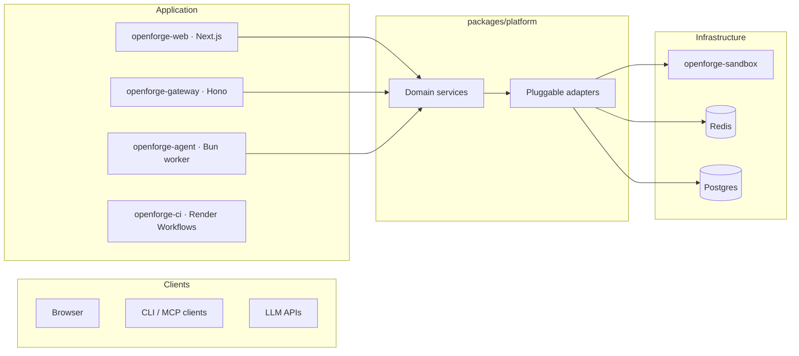

# OpenForge

An open-source AI coding agent you deploy on [Render](https://render.com). Connect your GitHub repos, describe what you want built, and let the agent write code, run tests, and open pull requests. Deploy the result to production with one click.

[](https://render.com/deploy?repo=https://github.com/render-oss/render-open-forge)

## How it works

1. **Sign in with GitHub** — OAuth connects your repos instantly. No mirroring, no setup.
2. **Start a session** — Pick a repo and branch. Tell the agent what to build.
3. **The agent works autonomously** — It reads your codebase, writes code, runs tests, creates branches, and opens PRs.
4. **Deploy to Render** — Preview environments spin up for every PR. Merge and ship to production.

## Architecture



| Component | What it does |
|---|---|
| **openforge-web** | Next.js 15 app: auth, sessions, chat UI, repo browser, PR review, streaming |
| **openforge-gateway** | Hono REST/SSE/MCP API — connect Claude Desktop, Cursor, or any MCP client |
| **openforge-agent** | Bun worker reading jobs from Redis Streams, driving multi-step LLM execution |
| **openforge-sandbox** | Isolated Docker environment for git operations and code execution |
| **openforge-ci** | Render Workflows task runner: clone, run CI steps, post results |

## Repo layout

```
apps/
  web/                   Next.js 15: auth, chat UI, repo browser, streaming (port 4000)
  gateway/               Hono headless API: REST, SSE, MCP (port 4100)
  agent/                 Agent worker: LLM tools, skills, Redis Streams consumer
  ci-runner/             Render Workflows CI task runner

packages/
  platform/              Framework-agnostic service layer, ForgeProvider abstraction
  db/                    Shared Drizzle ORM schema
  shared/                Error hierarchy, logger, API types, model catalog
  skills/                Skill pipeline: builtins, resolve, install, provisioning
  sandbox/               SandboxAdapter interface + HTTP provider
  ui/                    Shared React components and hooks
```

## Quick start (local dev)

### 1. Clone and install

```bash
git clone https://github.com/render-oss/render-open-forge.git
cd render-open-forge
bun install
```

### 2. Configure environment

```bash
cp .env.example .env
```

Fill in the required values — see the `.env.example` comments for guidance. At minimum you need:

- `GITHUB_OAUTH_CLIENT_ID` / `GITHUB_OAUTH_CLIENT_SECRET` — [create a GitHub OAuth App](https://github.com/settings/developers) with callback URL `http://localhost:4000/api/auth/callback/github`
- `AUTH_SECRET` — generate with `openssl rand -base64 32`
- `ANTHROPIC_API_KEY` — from your [Anthropic account](https://console.anthropic.com/)
- `ADMIN_EMAIL` / `ADMIN_PASSWORD` — for the auto-created admin account

### 3. Start infrastructure

```bash
bun run infra:up
```

Starts Postgres (5433), Redis (6380), and the sandbox.

### 4. Push database schema

```bash
bun run db:push
```

### 5. Start the app

```bash
bun run dev
```

Next.js on `http://localhost:4000` and the agent worker start side by side. Sign in with GitHub or use your admin credentials.

### Useful commands

```bash
bun run infra:logs     # tail Docker service logs
bun run infra:down     # stop containers (data volumes preserved)
bun run db:studio      # Drizzle Studio on http://localhost:4983
bun run typecheck      # check all packages
bun run test           # run tests
bun run gateway        # start headless API gateway on http://localhost:4100
```

## Deploy to Render

The `render.yaml` blueprint provisions all services. Fork this repo, then:

### 1. Create a GitHub OAuth App

Go to [GitHub Developer Settings](https://github.com/settings/developers) and create an OAuth App:
- **Homepage URL**: `https://<your-web-url>.onrender.com`
- **Authorization callback URL**: `https://<your-web-url>.onrender.com/api/auth/callback/github`

### 2. Deploy the blueprint

Go to [render.com/deploy](https://render.com/deploy?repo=https://github.com/render-oss/render-open-forge). Connect your fork. This creates all services, databases, and auto-generates secrets.

### 3. Set environment variables

After provisioning, set these on `openforge-web`:

| Variable | Value |
|---|---|
| `GITHUB_OAUTH_CLIENT_ID` | From your GitHub OAuth App |
| `GITHUB_OAUTH_CLIENT_SECRET` | From your GitHub OAuth App |
| `AUTH_URL` | `https://<web-url>.onrender.com` |
| `NEXT_PUBLIC_APP_URL` | Same as AUTH_URL |
| `ADMIN_EMAIL` | Email for the admin account |
| `ADMIN_PASSWORD` | Password for signing in |
| `ANTHROPIC_API_KEY` | Your Anthropic key |
| `RENDER_API_KEY` | Render Dashboard > Account Settings > API Keys |

Set `ANTHROPIC_API_KEY` on `openforge-agent` as well.

### 4. Push the database schema

```bash
DATABASE_URL="<external-connection-string>?sslmode=require" bun run db:push
```

Get the external connection string from the `openforge-db` database page in the Render Dashboard.

### 5. Redeploy and verify

Redeploy all services, then check:
- `https://<web-url>/api/health` should return `{"status":"healthy"}`
- Sign in with GitHub at `https://<web-url>`

## Documentation

- [`docs/architecture.md`](docs/architecture.md) — System design, services, adapters, ForgeProvider
- [`docs/capabilities.md`](docs/capabilities.md) — Agent tools, skills, CI, streaming
- [`docs/environment.md`](docs/environment.md) — Environment variable reference
- [`apps/gateway/README.md`](apps/gateway/README.md) — Headless API, MCP tools, SSE streams

## License

Open source. See [LICENSE](./LICENSE) for details.
