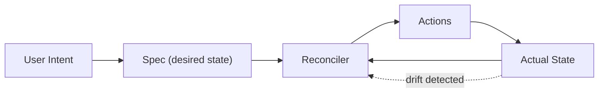
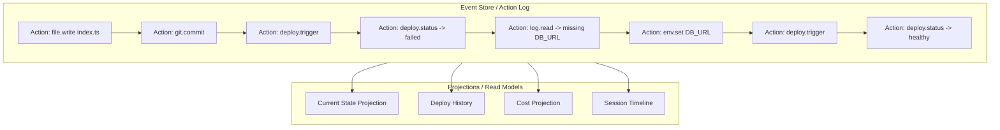
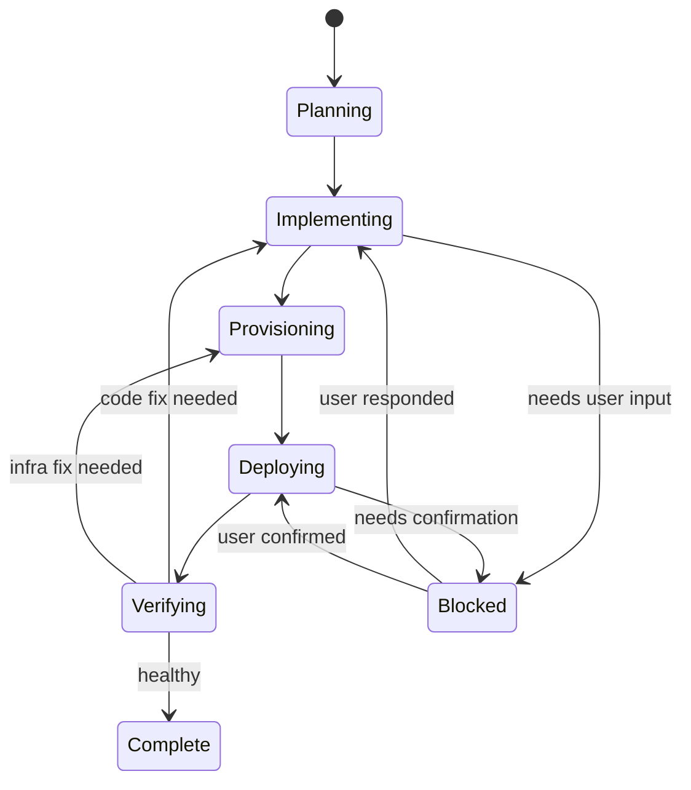
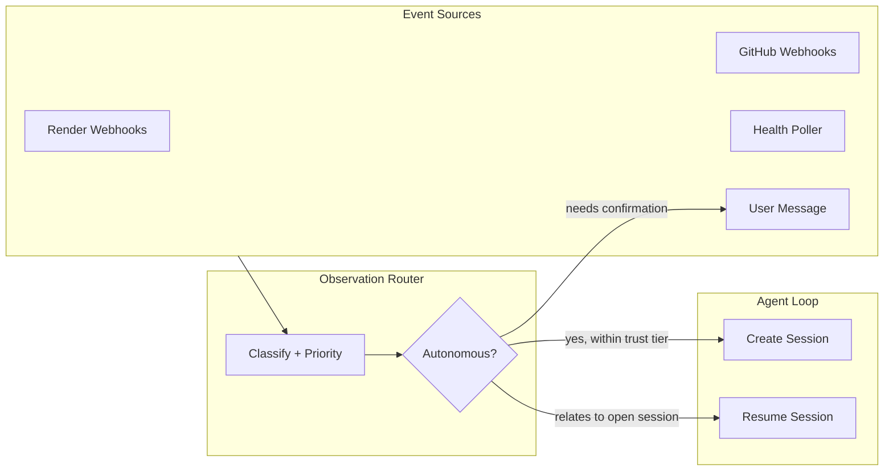
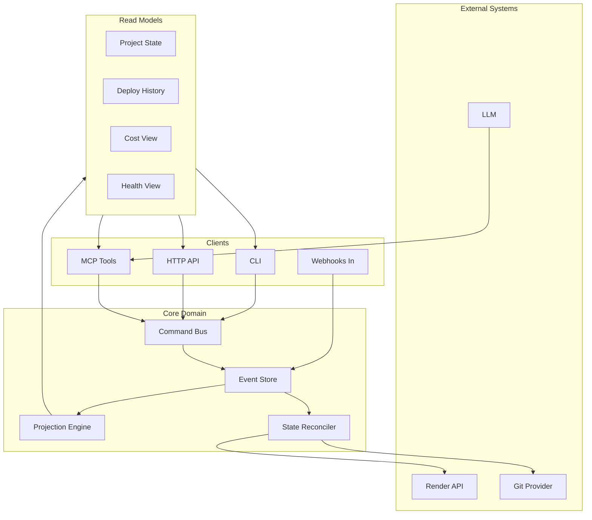
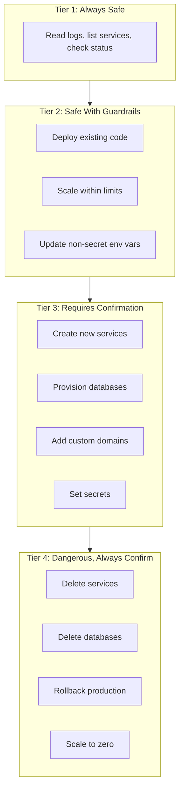
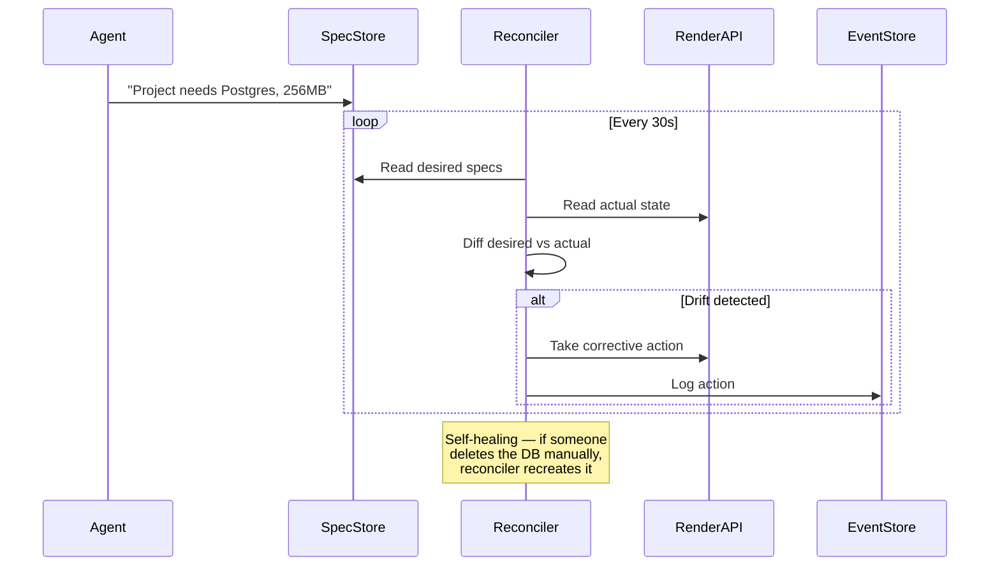

# Core Abstractions: Software Engineering Agent

> The foundational primitives, data models, and data flows for an autonomous software engineering agent with Render at the heart. Designed as a unified CLI, HTTP, and MCP server interface.

## Design Principles

1. **One command vocabulary, three transports** — CLI, HTTP, and MCP are the same surface
2. **Event sourcing** — the action log is the source of truth, everything else is a projection
3. **Declarative reconciliation for infra, imperative for code** — specs converge, files are written
4. **The agent is a user of its own interface** — dogfooding all the way down

---

## Core Abstraction 1: Project

A **Project** is the top-level aggregate. It's not a repo. It's not a service. It's the *whole thing* — code, infrastructure, configuration, history.

```
Project
├── Source (git repo, branches, commits)
├── Environments (dev, staging, production)
│   ├── Services (web, worker, cron)
│   ├── Datastores (postgres, redis)
│   └── Config (env vars, secrets, domains)
├── Specs (what should be true about this project)
└── EventLog (everything that has ever happened)
```

The Project is the **identity**. Everything else hangs off it. When the agent starts working, it loads the Project and has full context: what the code does, what's deployed, what's healthy, what's broken.

Why this matters: today's tools fragment this. The code lives in GitHub, the infra lives in Render's dashboard, the errors live in Sentry, the logs live in Datadog. The agent needs a **unified projection** of all of it.

---

## Core Abstraction 2: Spec

A **Spec** is a declarative statement of intent — what should be true, not how to make it true.

```typescript
{
  kind: "ServiceSpec",
  name: "api",
  runtime: "node",
  source: { repo: "myapp", path: "apps/api" },
  scaling: { min: 2, max: 10, targetCpu: 70 },
  healthCheck: { path: "/health", interval: 30 },
  dependsOn: ["postgres-main", "redis-cache"]
}
```

The key insight from modern distributed systems: **specs are not commands, they're convergence targets.** The system continuously reconciles actual state toward desired state. This is the Kubernetes pattern, but at a higher level of abstraction.

The agent's job is to:
1. Turn user intent into specs
2. Reconcile specs against reality
3. Take actions to close the gap

This is fundamentally different from a task queue ("do X, then Y, then Z"). It's a **control loop**.



---

## Core Abstraction 3: Environment

An **Environment** is a complete, isolated instance of the project's infrastructure. Not just "staging vs production" — every agent session could spin up an ephemeral environment.

```
Environment
├── id: "env_preview_abc123"
├── kind: "preview" | "staging" | "production"
├── services: [resolved service instances]
├── datastores: [resolved datastore instances]
├── config: [resolved env vars + secrets]
├── status: "provisioning" | "healthy" | "degraded" | "destroyed"
└── parentEnv: "env_production" (for preview forks)
```

Environments are **forkable**. The agent says "I need to test this change" and forks production into a preview environment — same schema, same config shape, isolated instances. This maps directly to Render's preview environment concept.

---

## Core Abstraction 4: Action

An **Action** is the atomic unit of work. Everything the agent does — writing a file, deploying a service, scaling an instance — is an Action. Actions are the **events** in the event-sourced system.

```typescript
type Action = {
  id: string;
  projectId: string;
  sessionId: string;
  timestamp: number;

  // What happened
  kind: "file.write" | "git.commit" | "service.create" | "deploy.trigger"
      | "env.set" | "db.migrate" | "scale.update" | "rollback" | ...;
  input: Record<string, unknown>;
  output: Record<string, unknown>;

  // Outcome
  status: "pending" | "running" | "succeeded" | "failed" | "rolled_back";
  error?: string;

  // Lineage
  causedBy?: string;      // parent action or event that triggered this
  compensatedBy?: string;  // rollback action if this was undone
}
```

This is where **event sourcing** becomes powerful. The action log isn't just an audit trail — it's the **source of truth**. You can:

- **Replay**: "What happened during the last deploy?" -> read the action log
- **Undo**: "Roll back the last 3 actions" -> emit compensating actions
- **Debug**: "Why is production broken?" -> trace the causal chain of actions
- **Learn**: "What patterns lead to failed deploys?" -> analyze action sequences



---

## Core Abstraction 5: Session

A **Session** is a bounded unit of agent work with a goal. It's the container for a conversation, a set of actions, and an outcome.

```
Session
├── id: "ses_xyz"
├── projectId: "proj_abc"
├── goal: "Add Stripe billing and deploy"
├── environment: "env_preview_abc123"
├── status: "planning" | "implementing" | "deploying" | "verifying" | "complete" | "blocked"
├── actions: [ordered list of actions taken]
├── checkpoints: [snapshots the agent can revert to]
└── messages: [user <-> agent conversation]
```

Sessions have **phases** that map to the lifecycle:



---

## Core Abstraction 6: Observation

An **Observation** is an external signal the system receives — not an action the agent takes, but something that *happens* in the world.

```typescript
type Observation = {
  id: string;
  projectId: string;
  timestamp: number;
  source: "render" | "github" | "sentry" | "healthcheck" | "user";
  kind: "deploy.completed" | "health.degraded" | "error.spike"
      | "pr.merged" | "cost.threshold" | "user.message";
  data: Record<string, unknown>;
}
```

Observations flow into the system via webhooks, polling, or user input. They can **trigger** sessions autonomously:

- Render webhook: "deploy failed" -> agent creates session to diagnose and fix
- Health check: "service unhealthy" -> agent creates session to investigate
- Cost alert: "spending up 50%" -> agent creates session to analyze and optimize
- PR merged: "new code on main" -> agent creates session to deploy

This is where the system becomes **reactive**, not just responsive. The agent doesn't wait for the user to say "it's broken" — it notices and acts.



---

## The Unified Interface

One command vocabulary, three transports:

```
forge project create myapp
forge project status
forge env create staging --from production
forge deploy --env staging
forge observe --stream
forge session start "add billing"
forge session status ses_xyz
forge action list --session ses_xyz
forge rollback --to checkpoint_abc
```

Same commands map 1:1 to:
- **HTTP**: `POST /projects`, `GET /projects/:id/status`, `POST /envs`, `POST /deploys`
- **MCP**: `forge_project_create`, `forge_project_status`, `forge_env_create`, `forge_deploy`
- **CLI**: `forge project create`, `forge project status`, `forge env create`, `forge deploy`

The MCP surface is the most important because it's what the agent uses to talk to itself. When Claude calls `forge_deploy`, it's using the same interface a human uses from the CLI.



---

## Safety: Trust Tiers

Infrastructure changes are high-stakes and often irreversible.



The agent should also have a **cost model**. "Create a Postgres Pro instance" isn't just an API call — it's $100/month. The agent should surface cost implications before acting.

---

## Reconciliation Model

The deepest architectural choice: how to handle the gap between desired state (specs) and actual state (what's running on Render).

**Declarative reconciliation for infrastructure, imperative for code.**

Writing a file is imperative and idempotent. But provisioning a database should be declarative — "this project needs a Postgres instance with these specs" — and the reconciler handles creating it, checking if it already exists, upgrading it if the spec changed.



---

## Summary of Core Abstractions

| Abstraction | What It Represents | Pattern |
|---|---|---|
| **Project** | The whole thing — code, infra, config, history | Aggregate root |
| **Spec** | Desired state — what should be true | Declarative, convergence target |
| **Environment** | An isolated instance of the project's infra | Forkable, lifecycle-managed |
| **Action** | Something the agent did | Event-sourced, append-only |
| **Observation** | Something that happened externally | Event-sourced, triggers sessions |
| **Session** | A bounded unit of agent work toward a goal | Stateful, phased, checkpointed |

---

*Document created: May 8, 2026*
*Status: Core abstractions and data model design*
*Previous: [Software Engineering Agent Vision](./software-engineering-agent-vision.md)*
*Next: Extended data models, concrete schemas, implementation plan*
