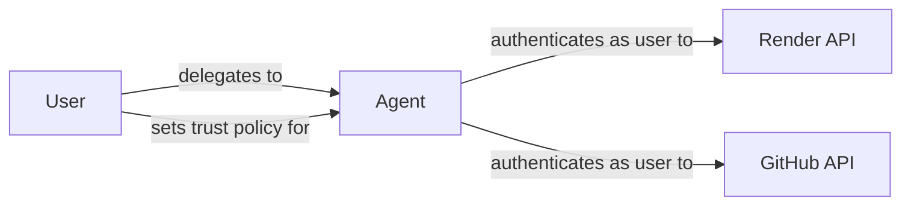
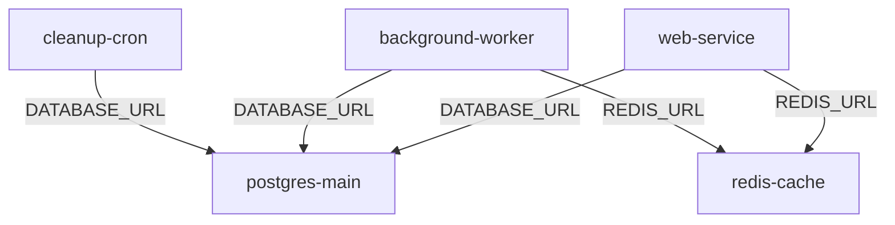
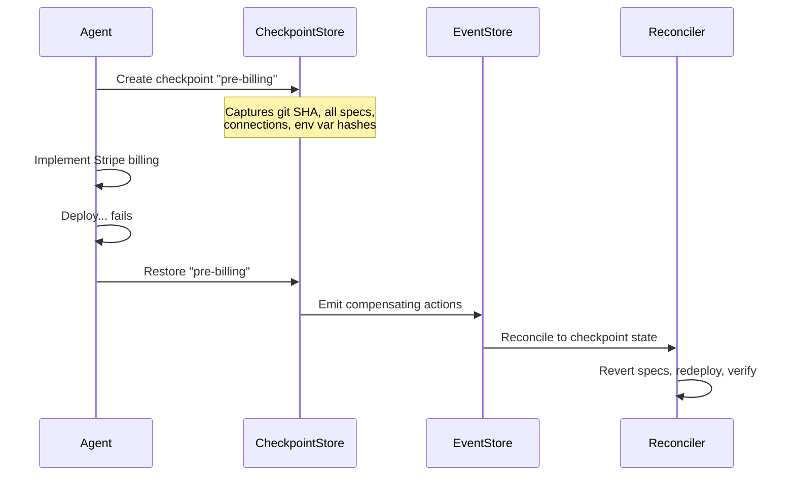
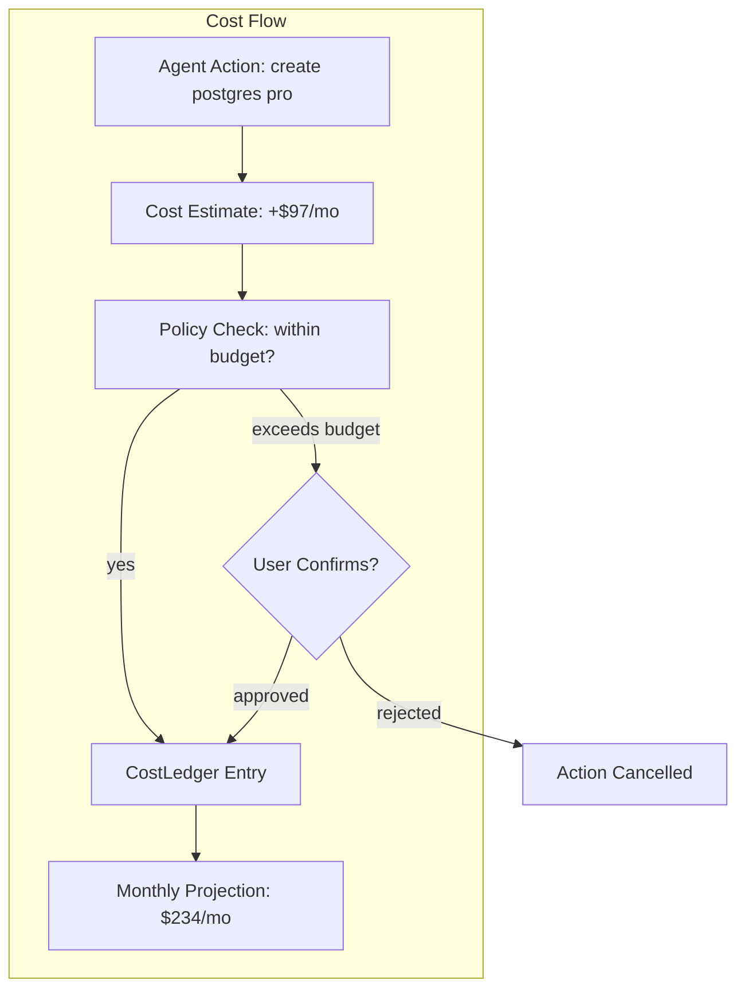
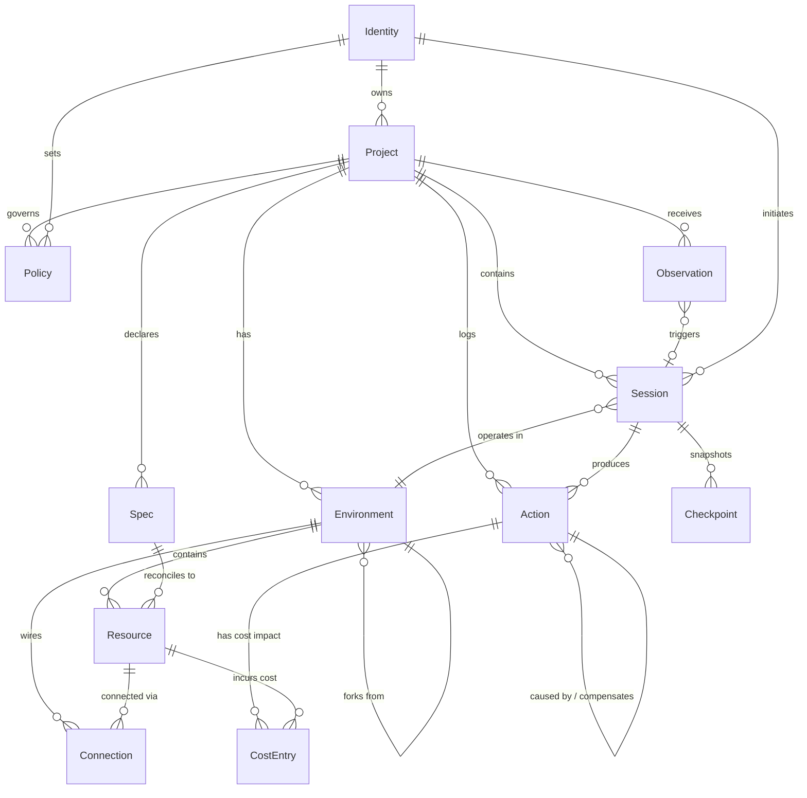
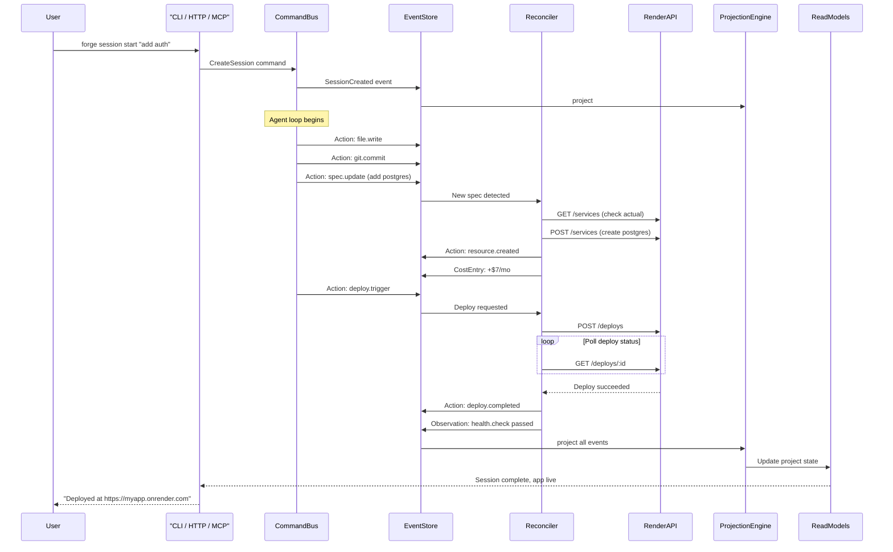

# Extended Data Models: Software Engineering Agent

> Beyond the six core abstractions — the full data model, relationships, storage strategy, and type system for the unified CLI/HTTP/MCP interface.

*Previous: [Core Abstractions](./core-abstractions.md)*

---

## What's Missing From the Six Core Abstractions?

The six (Project, Spec, Environment, Action, Observation, Session) are the structural primitives. A real system also needs:

- **Identity and access** — who is this, what can they do
- **Resources** — the concrete things running on Render (not the specs, the actual instances)
- **Connections** — how services wire together (topology, not just dependency lists)
- **Checkpoints** — revertible snapshots of state (not just git commits, full system state)
- **Cost** — the financial model is a first-class concern, not an afterthought
- **Policies** — rules that govern autonomous behavior

---

## Abstraction 7: Identity

Three kinds of actors interact with the system:

```
Identity
├── User (human)
│   ├── id, email, name
│   ├── authProvider (GitHub, Google, API key)
│   ├── role: "owner" | "member" | "viewer"
│   └── trustLevel: controls what the agent can do autonomously
│
├── Agent (AI)
│   ├── id, model, version
│   ├── sessionId (scoped to current work)
│   ├── capabilities (which tools it can call)
│   └── trustTier (inherited from user + policy)
│
└── Service (machine-to-machine)
    ├── id, name
    ├── apiKey (hashed)
    └── scopes (which endpoints it can call)
```

The critical design decision: **the agent acts *as* the user, not *for* the user.** When the agent calls `render_deploy`, it authenticates with the user's Render API key. The user's billing, the user's permissions, the user's audit trail. The agent is a tool, not a separate actor.

This means the identity model is really about **delegation**:



---

## Abstraction 8: Resource

A **Resource** is a concrete, running instance of infrastructure — the actual state counterpart to a Spec's desired state.

```typescript
type Resource = {
  id: string;
  projectId: string;
  environmentId: string;

  // What it is
  kind: "web_service" | "worker" | "cron_job" | "postgres" | "redis" | "static_site";
  name: string;

  // External identity (Render's IDs)
  externalId: string;       // e.g. "srv-abc123"
  externalUrl?: string;     // e.g. "https://myapp.onrender.com"
  internalUrl?: string;     // e.g. "http://myapp:10000"

  // Lifecycle
  status: "creating" | "deploying" | "running" | "failed" | "suspended" | "deleted";

  // Current configuration (what Render actually has)
  config: {
    plan: string;
    region: string;
    runtime?: string;
    scaling?: { instances: number; min?: number; max?: number };
    envVars: Record<string, string>;  // names only, values redacted
  };

  // Health
  health: {
    status: "healthy" | "unhealthy" | "unknown";
    lastCheck: number;
    consecutiveFailures: number;
  };

  // Lineage
  specId: string;           // which spec this was created from
  lastDeployId?: string;
  createdByAction: string;  // action that provisioned this
}
```

The Resource is the **live mirror** of what exists on Render. It's updated by the reconciler, not by the agent directly. The agent writes Specs; the reconciler creates/updates Resources.

Why separate Spec from Resource? Because they drift. A Spec says `scaling.min: 2`. The Resource shows `scaling.instances: 1` because someone manually scaled down in the dashboard. The reconciler detects this drift and corrects it. This separation is the foundation of self-healing.

---

## Abstraction 9: Connection

A **Connection** describes how two Resources wire together. This is the topology of the system.

```typescript
type Connection = {
  id: string;
  projectId: string;
  environmentId: string;

  // Source and target
  from: { resourceId: string; port?: number };
  to: { resourceId: string; port?: number };

  // How they're connected
  kind: "env_var" | "internal_url" | "connection_string";

  // The actual wiring
  binding: {
    envVarName: string;       // e.g. "DATABASE_URL"
    valueTemplate: string;    // e.g. "${to.connectionString}"
    resolved?: string;        // the actual resolved value (redacted for secrets)
  };
}
```

Why its own abstraction? The **topology** is where most production bugs live. "The web service can't reach the database" isn't a code bug or an infra bug — it's a wiring bug. The agent needs to reason about connections explicitly:



When the agent provisions a new Postgres instance, it doesn't just create the database — it creates Connections for every service that depends on it, resolves the connection string, and sets the env vars. The Connection abstraction makes this explicit and inspectable.

---

## Abstraction 10: Checkpoint

A **Checkpoint** is a snapshot of the entire system state at a point in time — not just code, but infra config, env vars, and service status.

```typescript
type Checkpoint = {
  id: string;
  projectId: string;
  sessionId: string;

  // When
  timestamp: number;
  actionSequenceNumber: number;  // position in the event log

  // What was captured
  label: string;                 // "before Stripe integration"
  kind: "manual" | "auto_pre_deploy" | "auto_pre_destructive";

  // Snapshot data
  snapshot: {
    gitRef: string;              // commit SHA
    branch: string;
    specs: Spec[];               // all specs at this point
    connections: Connection[];
    envVarHashes: Record<string, string>;  // for drift detection, not values
  };

  // Restoration
  restoredAt?: number;
  restoredByAction?: string;
}
```

Checkpoints are created automatically before dangerous operations (deploys, schema migrations, destructive changes) and manually by the user or agent ("save this as a known-good state"). Rolling back means:

1. Reset git to the checkpoint's commit
2. Diff specs against current specs, generate compensating actions
3. Reconcile resources back to the checkpoint state
4. Verify health

This is fundamentally different from "rollback to the last deploy." A Checkpoint captures the **full system state**, not just a deploy artifact.



---

## Abstraction 11: CostLedger

Cost is a first-class domain object, not a reporting afterthought.

```typescript
type CostEntry = {
  id: string;
  projectId: string;
  environmentId: string;
  resourceId: string;

  // What changed
  actionId: string;           // the action that caused this cost change
  sessionId: string;

  // Cost data
  kind: "provision" | "scale" | "plan_change" | "teardown";
  deltaMonthlyCents: number;  // positive = more expensive, negative = savings
  newMonthlyCents: number;    // new total for this resource

  // Context
  plan: string;               // e.g. "starter", "standard", "pro"
  resourceKind: string;       // e.g. "postgres", "web_service"

  timestamp: number;
}
```

The CostLedger enables:
- **Pre-action estimates**: "This will add $19/month to your bill"
- **Session cost summaries**: "This session cost $0 to implement, and adds $38/month in infrastructure"
- **Budget policies**: "Don't provision anything that would push monthly cost above $200 without asking"
- **Optimization suggestions**: "You have a Pro Postgres with 12% utilization — downgrade to Starter?"



---

## Abstraction 12: Policy

A **Policy** is a rule that governs autonomous behavior. Policies are what make the agent safe without making it useless.

```typescript
type Policy = {
  id: string;
  projectId: string;       // null for account-wide

  // What it governs
  scope: "action" | "cost" | "environment" | "schedule";

  // The rule
  rule: PolicyRule;

  // Metadata
  createdBy: string;        // user who set this
  enabled: boolean;
}

type PolicyRule =
  | { kind: "trust_tier"; actionKinds: string[]; tier: 1 | 2 | 3 | 4 }
  | { kind: "cost_limit"; maxMonthlyDeltaCents: number; requireConfirmation: boolean }
  | { kind: "env_protection"; environmentId: string; requireConfirmation: string[] }
  | { kind: "schedule"; allowAutonomous: { after: string; before: string } }
  | { kind: "scope_limit"; maxServicesPerSession: number; maxDbPerSession: number }
```

Example policies:
- "Never delete production resources without confirmation" — `env_protection` on production env
- "Keep monthly spend under $500" — `cost_limit` with max delta
- "Only act autonomously during business hours" — `schedule` rule
- "The agent can deploy to staging but not production" — `trust_tier` per environment
- "Max 3 services per session to prevent runaway provisioning" — `scope_limit`

Policies are what distinguish a **tool** from a **coworker**. You don't give a junior engineer production SSH access on day one. You shouldn't give an agent unbounded infrastructure access either.

---

## The Complete Entity Relationship



---

## The Type System: Unified Interface

Every operation is a **Command** (write) or **Query** (read):

```typescript
// Commands (things that change state)
type Command =
  | { kind: "project.create"; name: string; source?: string }
  | { kind: "project.delete"; projectId: string }
  | { kind: "env.create"; projectId: string; envKind: string; forkFrom?: string }
  | { kind: "env.destroy"; environmentId: string }
  | { kind: "spec.apply"; projectId: string; specs: Spec[] }
  | { kind: "deploy.trigger"; environmentId: string; commitSha?: string }
  | { kind: "deploy.rollback"; environmentId: string; toDeployId: string }
  | { kind: "session.create"; projectId: string; goal: string }
  | { kind: "session.message"; sessionId: string; content: string }
  | { kind: "session.stop"; sessionId: string }
  | { kind: "checkpoint.create"; sessionId: string; label: string }
  | { kind: "checkpoint.restore"; checkpointId: string }
  | { kind: "policy.set"; projectId: string; rule: PolicyRule }

// Queries (things that read state)
type Query =
  | { kind: "project.status"; projectId: string }
  | { kind: "project.list" }
  | { kind: "env.status"; environmentId: string }
  | { kind: "resource.list"; environmentId: string }
  | { kind: "action.list"; sessionId?: string; projectId?: string; since?: number }
  | { kind: "observation.list"; projectId: string; since?: number }
  | { kind: "session.status"; sessionId: string }
  | { kind: "cost.summary"; projectId: string; period?: string }
  | { kind: "health.check"; environmentId: string }
  | { kind: "logs.read"; resourceId: string; lines?: number }
  | { kind: "logs.stream"; resourceId: string }
```

Every transport (CLI, HTTP, MCP) parses its input into one of these types and passes it to the same handler. This is CQRS — commands go through the event store, queries read from projections.

---

## Storage Strategy

Different data has different access patterns:

**Hot path (Postgres):**
- Projects, Environments, Specs, Resources, Connections, Policies — relational, queried frequently, need transactions
- Sessions (active) — real-time read/write during agent work
- Checkpoints (recent) — fast restore

**Warm path (Event store — append-only Postgres tables):**
- Actions — append-only, ordered by sequence number, queried by project+session
- Observations — append-only, queried by project+time range
- CostEntries — append-only, aggregated for projections

**Projections (Redis or materialized views):**
- Current project state — rebuilt from events, cached
- Active session state — real-time
- Health status — polled and cached
- Cost totals — aggregated and cached

The event store doesn't need a specialized product at the start. Postgres with an append-only `events` table, a `sequence_number` column, and proper indexes is sufficient. Scale to a proper event store when needed — the abstraction is the same either way.

---

## Data Flow: Full Build and Deploy Sequence



---

## Summary: All Twelve Abstractions

| # | Abstraction | What It Represents | Pattern |
|---|---|---|---|
| 1 | **Project** | The whole thing — code, infra, config, history | Aggregate root |
| 2 | **Spec** | Desired state — what should be true | Declarative, convergence target |
| 3 | **Environment** | An isolated instance of the project's infra | Forkable, lifecycle-managed |
| 4 | **Action** | Something the agent did | Event-sourced, append-only |
| 5 | **Observation** | Something that happened externally | Event-sourced, triggers sessions |
| 6 | **Session** | A bounded unit of agent work toward a goal | Stateful, phased, checkpointed |
| 7 | **Identity** | Who is acting and what they can do | Delegation-based |
| 8 | **Resource** | A concrete, running infrastructure instance | Live mirror of actual state |
| 9 | **Connection** | How two resources wire together | Topology graph |
| 10 | **Checkpoint** | Full system state snapshot at a point in time | Revertible |
| 11 | **CostLedger** | Financial impact of every action | First-class cost tracking |
| 12 | **Policy** | Rules governing autonomous behavior | Trust + safety guardrails |

---

*Document created: May 8, 2026*
*Status: Extended data models and relationships*
*Previous: [Core Abstractions](./core-abstractions.md)*
*Previous: [Vision](./software-engineering-agent-vision.md)*
*Next: Additional abstractions, implementation plan*
