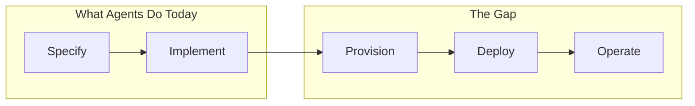
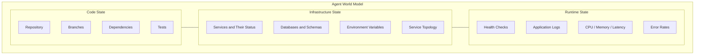
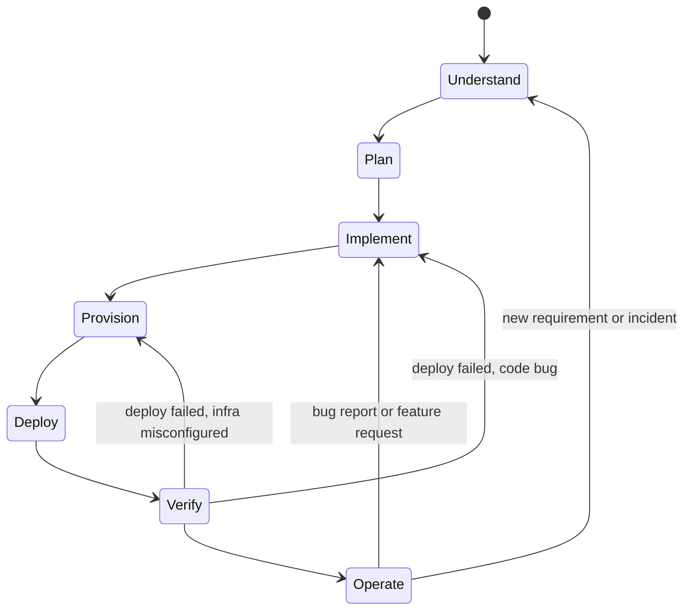
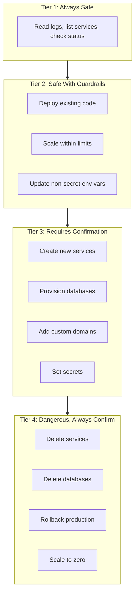
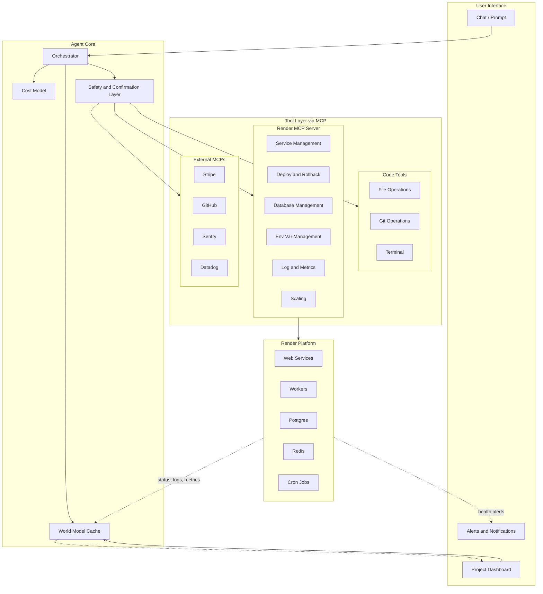

# Software Engineering Agent: Vision

> An autonomous AI coding agent that can not just develop, but build, deploy, scale, and maintain — with Render and agents at the heart.

## Starting Point: What Does "Building Software" Actually Mean?

When a human builds and ships software, they do roughly five things:

1. **Specify** — decide what to build (requirements, constraints, tradeoffs)
2. **Implement** — write code that satisfies the spec
3. **Provision** — create the infrastructure the code needs to run
4. **Deploy** — get the code running on that infrastructure
5. **Operate** — keep it running, fix it when it breaks, evolve it over time

Today's AI coding agents (Cursor, Copilot, Devin, OpenForge) handle step 2 well and are getting better at step 1. Steps 3-5 are almost entirely manual. That's the gap.

## First Principle: The Agent Should Own the Full Lifecycle

The fundamental unit isn't "write code" — it's **"make this thing exist and work."** An agent that can write a perfect Express server but can't deploy it is like a contractor who builds a house but can't connect the plumbing. The value is in the complete outcome.



## First Principle: Infrastructure Is Just Another API

There's no fundamental difference between:
- `fs.writeFile("app.ts", code)` — creating a file
- `render.createService({ type: "web", env: "node" })` — creating a service
- `render.createDatabase({ engine: "postgres" })` — creating a database

They're all API calls with inputs and outputs. The agent already reasons about file system state ("does this file exist? what's in it?"). It can reason about infrastructure state the same way ("does this service exist? is it healthy? what env vars does it have?").

The insight: **infrastructure management is a tool-use problem, not a fundamentally different capability.** The same agent loop — observe state, decide action, execute, verify — works for both code and infra.

## What the Full-Lifecycle Agent Looks Like

### Layer 1: Awareness (The Agent's World Model)

The agent needs a mental model of not just the codebase, but the full system:



Today, agents see only code state. The leap is giving them infrastructure state and runtime state as **context**, not just tools. Before the agent writes a single line of code, it should know:
- What services exist and how they connect
- What databases are provisioned and what schemas they have
- What environment variables are configured
- Whether the current deploy is healthy

This is the equivalent of how a senior engineer SSHs into prod, checks logs, reviews the dashboard, and *then* starts coding.

### Layer 2: Reasoning (The Decision Loop)

The agent's core loop expands from "write code → commit" to something richer:



The critical transitions are the **backward arrows**:
- Deploy fails with "ECONNREFUSED on port 5432" → agent reasons: "database connection failed" → checks if DB exists → either provisions one or fixes the connection string → redeploys
- Health check returns 500 → agent reads logs → "migration not run" → runs migration → verifies health
- User reports "it's slow" → agent checks metrics → "P95 latency 2s, single instance" → scales to 3 instances → verifies latency drops

This is the **self-healing loop** — and it's what makes an autonomous agent fundamentally different from a code generator.

### Layer 3: The Tool Surface

From first principles, what does the agent need to be able to *do*?

**Observe** (read-only, always safe):
- List services, their status, and configuration
- Read deploy logs (build + runtime)
- Stream application logs
- Check health endpoints
- Read current env vars
- Inspect database connection info and schema
- View scaling config and current resource usage

**Act** (state-changing, needs guardrails):
- Create/update/delete services
- Trigger deploys (with specific commit or latest)
- Set environment variables
- Provision databases and Redis instances
- Run one-off jobs (migrations, seeds, scripts)
- Scale services up/down
- Add custom domains
- Manage preview environments
- Rollback to a previous deploy

**Compose** (multi-step orchestration):
- Apply a full blueprint (render.yaml equivalent)
- Wire service dependencies (DB connection strings, internal URLs)
- Set up environment groups (staging, production)
- Configure deploy pipelines (build, test, deploy, verify)

### Layer 4: Safety and Trust

This is where first-principles thinking matters most. Infrastructure changes are **high-stakes and often irreversible**. Deleting a database is not like deleting a file.

**Trust tiers:**



The agent should have a **cost model** too. "Create a Postgres Pro instance" isn't just an API call — it's $100/month. The agent should surface cost implications before acting, the same way it surfaces breaking changes before refactoring.

## What This Enables That Nothing Else Does

### Scenario 1: "Build me a SaaS"

```
User: Build a project management tool with auth, 
      real-time updates, and team billing. Deploy it.

Agent:
1. Scaffolds Next.js app with auth (Clerk/Auth.js)
2. Creates render.yaml with web service + Postgres + Redis
3. Provisions all three on Render
4. Sets env vars (DB connection, Redis URL, auth secrets)
5. Deploys
6. Runs DB migrations
7. Verifies health check
8. Returns: "Live at https://your-app.onrender.com"
   - Web: running, healthy
   - Postgres: 256MB, connected
   - Redis: connected
   - Estimated cost: $21/month
```

### Scenario 2: "It's down"

```
User: My app is returning 500 errors

Agent:
1. Checks service status → running
2. Reads recent logs → "Error: relation 'users' does not exist"
3. Diagnoses: migration wasn't run after last schema change
4. Runs: one-off job with `npx drizzle-kit migrate`
5. Verifies: health check returns 200
6. Reports: "Fixed. The users table was missing — 
   ran pending migration. App is healthy now."
```

### Scenario 3: "We're getting traffic"

```
User: We just got featured on HN, site is slow

Agent:
1. Checks metrics → CPU at 95%, P95 latency 4s, 1 instance
2. Scales web service to 4 instances
3. Checks DB → connection pool exhausted
4. Upgrades Postgres plan (with confirmation)
5. Monitors for 5 minutes → latency back to 200ms
6. Reports: "Scaled to 4 instances, upgraded DB. 
   Latency is normal. Estimated cost increase: $45/month.
   Want me to set up autoscaling for next time?"
```

### Scenario 4: "Ship this feature safely"

```
User: Add Stripe billing. Don't break production.

Agent:
1. Creates preview environment on Render
2. Implements Stripe integration
3. Deploys to preview → runs tests
4. Preview is healthy → creates PR
5. User approves PR
6. Agent merges, deploys to production
7. Verifies production health
8. Tears down preview environment
```

## The Architectural Shape



## The Key Insight

The differentiator isn't any single capability. It's the **closed loop**. Today's tools are all open-loop:

- Cursor: writes code, human deploys
- Vercel: deploys code, human writes and debugs
- Render: runs infra, human configures everything
- Sentry: reports errors, human fixes them

An agent with Render MCP tools **closes every loop**:
- Write code → deploy → verify → fix → redeploy
- Error detected → diagnose → fix → deploy → verify
- Scale needed → scale → verify → report cost
- Feature requested → implement → test → preview → ship

That's not just a coding agent. It's a **software engineering agent**. The agent doesn't write code — it **ships software**.

## What Render Uniquely Brings

Why Render specifically, and not "any cloud"?

1. **Right level of abstraction**: Render's API is service-level, not VM-level. The agent reasons about "web service" and "database", not "EC2 instance with security groups and IAM roles." This matches how the agent thinks.
2. **Blueprint as code**: `render.yaml` is already a declarative spec the agent can generate and version-control. It's the bridge between code and infra.
3. **Preview environments**: Built-in concept of ephemeral environments for testing before production. Perfect for agent workflows.
4. **Integrated primitives**: Postgres, Redis, cron, workers, static sites — all first-party, all one API. No stitching together 5 different AWS services.
5. **Predictable pricing**: The agent can reason about cost because Render's pricing is simple and per-service. Try having an agent estimate an AWS bill.

The philosophical alignment is strong: Render abstracts away infrastructure complexity so developers can focus on code. An agent layer abstracts away the developer so users can focus on intent. They're complementary abstractions.

---

*Document created: May 8, 2026*
*Status: Vision / first-principles analysis*
*Next: Continue refining architecture, define Render MCP tool surface, prototype deploy loop*
