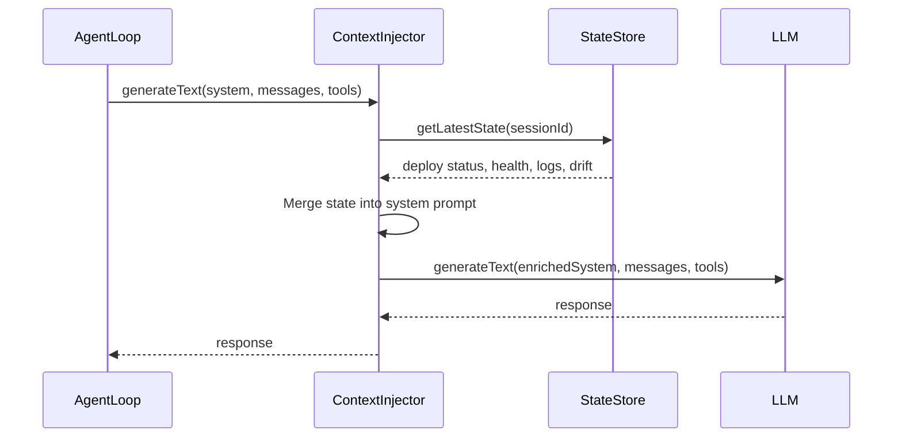
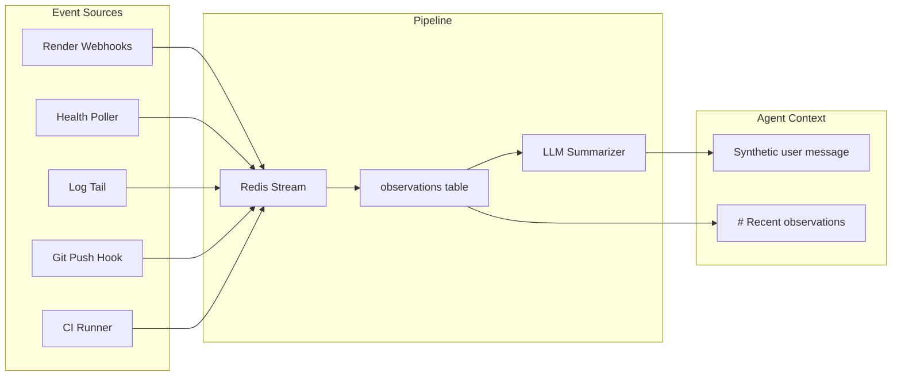
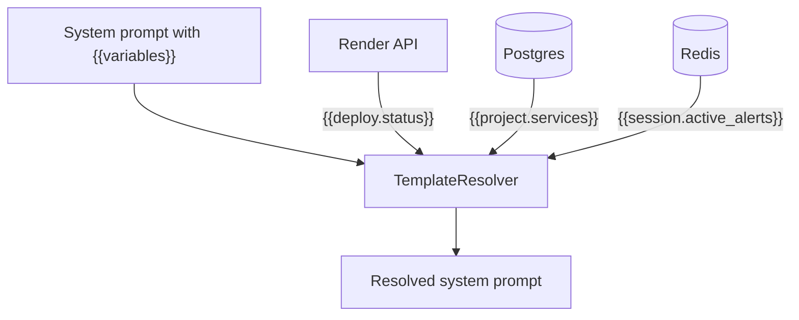
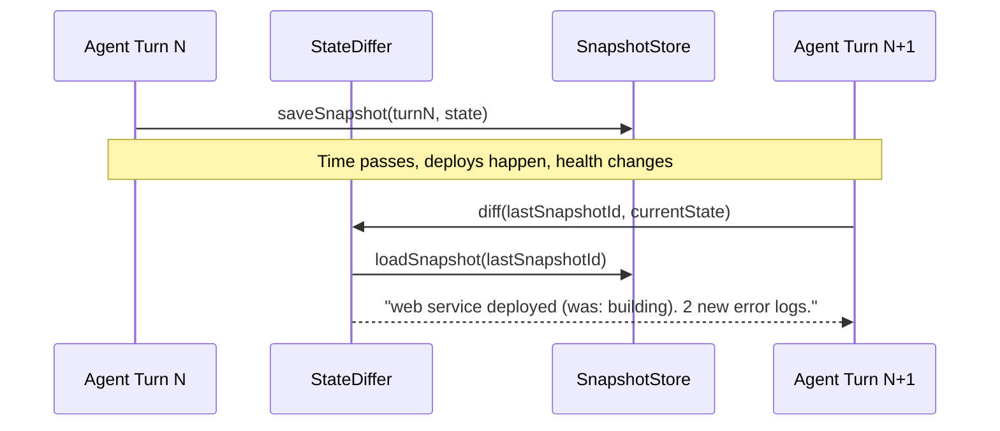
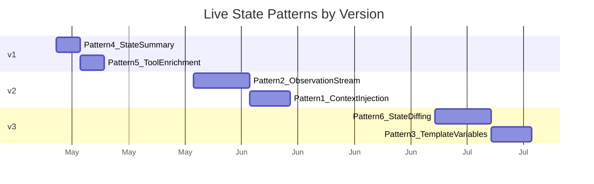

# v3+: Live System State — Patterns for Agent Situational Awareness

> The agent can't operate what it can't see. These patterns give the agent continuous, cost-effective visibility into the live state of the system it builds and operates.

*Previous: [v1 & v2 Plans](./v1-v2-plans.md)*

---

## The Problem

Today, the agent's "world model" is mostly static. It receives a system prompt with repo/branch info at session start, then only learns about the live system through explicit tool calls (`render_get_logs`, `render_list_services`, etc.). Each reconnaissance tool call costs tokens and latency. Worse, the agent has to *remember* to check — it has no ambient awareness of deploy failures, health degradation, or configuration drift.

For a true SWE agent that operates across the full lifecycle (Specify → Implement → Provision → Deploy → Operate), the agent needs to **continuously see** the live state of the system it's building and operating.

---

## Pattern Catalog

### Pattern 1: Context Injection Layer

A middleware that wraps every `generateText` call and dynamically injects current state into the system prompt.



**How it works:** Instead of calling `generateText` directly, route through a `contextAwareGenerate` wrapper that:
1. Reads the latest state snapshot from a fast store (Redis or Postgres)
2. Appends a `# Live System State` block to the system prompt
3. Passes through to the real LLM call

**What gets injected:**
- Deploy status of relevant services (deploying / live / failed)
- Last health check result
- Recent error log lines (if any service is unhealthy)
- Env var drift (expected vs actual)
- Active alerts or observations

**Why this is powerful:** The agent never has to "remember" to check. State is always in its context window. It makes better decisions without wasting tool calls on reconnaissance.

**When to build:** v2 — once the Observation Stream (Pattern 2) provides structured state to read from.

---

### Pattern 2: Observation Stream

Rather than polling, the system pushes state changes into the agent's context as they happen.



**How it works:** External events (deploy completed, health degraded, CI failed, new PR comment) are captured as `Observation` objects and stored in a table. Before each agent turn, recent unacknowledged observations are:
- Injected as a `# Recent observations` block in the system prompt, **OR**
- Inserted as a synthetic user message: *"System: deploy srv-abc123 failed at 6:14pm. Logs show OOM."*

**Data model:**

```sql
CREATE TABLE observations (
  id            TEXT PRIMARY KEY,
  project_id    TEXT NOT NULL,
  session_id    TEXT,
  kind          TEXT NOT NULL,       -- 'deploy.completed' | 'health.degraded' | 'ci.failed' | ...
  severity      TEXT DEFAULT 'info', -- 'info' | 'warning' | 'critical'
  summary       TEXT NOT NULL,       -- human-readable one-liner
  detail        JSONB,               -- structured payload
  source        TEXT NOT NULL,       -- 'render_webhook' | 'health_poller' | 'ci_runner'
  acknowledged  BOOLEAN DEFAULT false,
  created_at    TIMESTAMPTZ DEFAULT now()
);
```

**Event sources (initial set):**

| Source | Trigger | Observation Kind |
|--------|---------|-----------------|
| Render deploy webhook | Deploy completes/fails | `deploy.completed`, `deploy.failed` |
| Health poller (cron) | HTTP health check fails | `health.degraded`, `health.recovered` |
| CI runner callback | Test suite fails | `ci.failed`, `ci.passed` |
| Git push hook | Code pushed to upstream | `code.pushed` |
| Log watcher | Error pattern detected | `error.detected` |

**Relationship to `fixContext`:** The existing `fixContext` field on `AgentJob` is a primitive version of this pattern — a string blob injected into the system prompt when CI fails. The Observation Stream generalizes it into a structured, multi-source pipeline.

**When to build:** v2 — the `observations` table is a natural extension of the `actions` table from the reconciler.

---

### Pattern 3: Template Variables with Live Resolution

Declarative placeholders in the system prompt that resolve to live values at call time.



**How it works:** The system prompt contains template variables:
- `{{services.status}}` — resolves to a table of service names + deploy status
- `{{deploy.latest}}` — resolves to the last deploy result
- `{{health.summary}}` — resolves to "all healthy" or a list of issues
- `{{cost.current_monthly}}` — resolves to current spend

A `TemplateResolver` evaluates these lazily (with caching) and replaces them before the prompt reaches the LLM.

**Variable registry:**

```typescript
interface TemplateVariable {
  name: string;                    // e.g. "services.status"
  resolve: (ctx: AgentContext) => Promise<string>;
  cacheTtlMs: number;             // how long to cache (e.g. 60_000 for 1 min)
  fallback: string;               // value if resolution fails
}
```

**Advantages:** Declarative, easy to add new variables, cacheable, and the prompt author controls what state the agent sees. Can be extended by users via `projectConfig`.

**When to build:** v3+ — requires the resolver infrastructure and a variable registry. Lower priority than Patterns 1-2 because the injection layer achieves the same result with less abstraction.

---

### Pattern 4: Hierarchical State Summary

The problem with injecting all live state is token cost. A smarter approach: inject a **compact summary** into the system prompt, and let the agent drill down via tools when it needs detail.

**Example output (2-5 lines, always present):**

```
# System State (as of 6:14pm)

All 4 services healthy. Last deploy: openforge-web 12min ago (live).
No active alerts. Monthly spend: $42.

Use render_* tools for details.
```

**Or, when something is wrong:**

```
# System State (as of 6:14pm)

WARNING: openforge-agent unhealthy (last health check failed 3min ago).
Last deploy: openforge-agent 8min ago (deploy_failed). 
2 active alerts. Monthly spend: $42.

Use render_get_logs to investigate.
```

**How it works:** A background job (cron or post-deploy hook) computes a compact state summary and caches it in Redis (key: `state:summary:{projectId}`, TTL: 5 min). The `buildLiveStateBlock()` function reads the cached summary — always small, always cheap.

**Implementation sketch:**

```typescript
async function buildLiveStateBlock(projectId: string): Promise<string | null> {
  const cached = await redis.get(`state:summary:${projectId}`);
  if (cached) return cached;

  const client = getRenderClient();
  const services = await client.listServices();
  
  const unhealthy = services.filter(s => s.suspended !== "not_suspended");
  const lastDeploy = await getLastDeploy(client, services);
  
  const lines = ["# System State"];
  if (unhealthy.length === 0) {
    lines.push(`All ${services.length} services healthy.`);
  } else {
    lines.push(`WARNING: ${unhealthy.map(s => s.name).join(", ")} unhealthy.`);
  }
  if (lastDeploy) {
    lines.push(`Last deploy: ${lastDeploy.service} ${lastDeploy.ago} (${lastDeploy.status}).`);
  }
  
  const summary = lines.join(" ");
  await redis.setex(`state:summary:${projectId}`, 300, summary);
  return summary;
}
```

**Why this is the highest-impact pattern:** Low token cost (always < 100 tokens), always fresh within 5 min, no wasted tool calls for the common case (everything is fine), and immediately actionable for the uncommon case (something is broken).

**When to build:** v1 — can be implemented in ~50 lines with just the existing Render client. No new tables or abstractions required.

---

### Pattern 5: Tool Result Enrichment

Instead of injecting state into prompts, enrich tool results with relevant context the agent didn't ask for but would benefit from.

**Example — current `render_deploy` response:**

```json
{
  "deployId": "dep-abc123",
  "status": "build_in_progress"
}
```

**Enriched response:**

```json
{
  "deployId": "dep-abc123",
  "status": "build_in_progress",
  "context": {
    "previousDeploy": { "status": "live", "commitId": "a1b2c3d", "age": "2h ago" },
    "serviceHealth": "healthy",
    "plan": "starter",
    "estimatedBuildTime": "~3min based on last 5 builds"
  }
}
```

**Which tools benefit most:**

| Tool | Enrichment |
|------|-----------|
| `render_deploy` | Previous deploy status, service health, build time estimate |
| `render_get_deploy_status` | Elapsed time, comparison to average, service URL if live |
| `render_get_logs` | Service health status, current deploy status, last restart time |
| `render_list_services` | Per-service health, last deploy age, monthly cost |
| `render_set_env_vars` | Reminder to redeploy, diff of what changed |

**Why this works well:** Zero extra tool calls. The agent gets richer context organically as part of its normal workflow. Implementation is cheap — just a few extra API calls inside existing tool handlers, behind a cache.

**When to build:** v1 — can be added incrementally to each tool. No new abstractions.

---

### Pattern 6: State Diffing

The most sophisticated pattern. Track what changed between agent turns and surface only the delta.



**How it works:**
1. After each agent turn, snapshot the current system state (service statuses, deploy states, health, env vars)
2. Before the next turn, diff the current state against the last snapshot
3. Inject only the delta: "Since your last turn: web service deployed successfully. 2 new error logs in agent service."

**State snapshot schema:**

```typescript
interface StateSnapshot {
  id: string;
  sessionId: string;
  turnNumber: number;
  timestamp: Date;
  services: Array<{
    id: string;
    name: string;
    status: string;
    lastDeployStatus: string;
    lastDeployAt: string;
    healthStatus: string;
  }>;
  activeAlerts: string[];
}
```

**Diff output:**

```typescript
interface StateDiff {
  changed: Array<{
    service: string;
    field: string;
    from: string;
    to: string;
  }>;
  newAlerts: string[];
  resolvedAlerts: string[];
  summary: string; // "2 changes since last turn"
}
```

**Why this prevents stale reasoning:** Without diffing, the agent might see "service unhealthy" in its context and try to fix something it already fixed last turn. The diff tells it "was unhealthy, now healthy" — no action needed.

**When to build:** v3+ — requires the `Resource` + `Spec` abstractions from v2 to have structured state to diff against. Before v2, there's no persistent state model to snapshot.

---

## Implementation Timeline



| Version | Patterns | Key Deliverable |
|---------|----------|-----------------|
| **v1** | 4 (State Summary) + 5 (Tool Enrichment) | Agent always knows if services are healthy |
| **v2** | 2 (Observation Stream) via observations table | Agent is notified of events without polling |
| **v3** | 1 (Context Injection) + 6 (State Diffing) + Reconciler | Agent reasons about deltas; specs auto-converge |
| **v4+** | 3 (Template Variables) + autonomous sessions | Declarative prompt variables; agent wakes itself |

## Design Principles

1. **Cheapest signal first.** A 2-line summary in the system prompt (Pattern 4) is worth more than a sophisticated diffing engine that costs 500 tokens per turn.

2. **Pull, then push.** Start with the agent pulling state via tools (v0), add a cached summary it always sees (v1), then push events to it (v2). Each layer reduces the need for explicit tool calls.

3. **Structured over unstructured.** Observations and state snapshots should be typed, not free-text blobs. This enables diffing, filtering, and aggregation.

4. **Cache aggressively.** Render API calls take 200-500ms. Cache service status for 60s, deploy status for 30s, health for 5min. The agent doesn't need real-time — it needs "recent enough."

5. **Fail open.** If the state cache is empty or the Render API is unreachable, the agent should still work — it just won't have the ambient state block. Tools still work for explicit queries.

6. **Token budget.** The live state block should never exceed 200 tokens. If there's too much to say, summarize and point to tools for detail.

---

*Document created: May 8, 2026*
*Previous: [v1 & v2 Plans](./v1-v2-plans.md)*
*See also: [Extended Data Models](./extended-data-models.md) for Observation, Resource, and Checkpoint abstractions*
