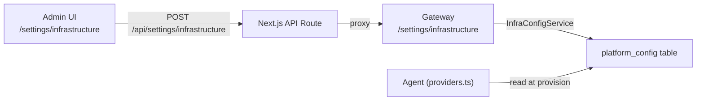

# Infrastructure Settings Tab

## Architecture

Admin-only settings tab at `/settings/infrastructure` that stores platform-wide configuration in a new `platform_config` key-value table. The agent reads these values at startup/provision time, falling back to environment variables when no DB row exists.



## Layer 1: Database Schema

Add a `platform_config` table to `packages/db/schema/platform.ts`:

```typescript
export const platformConfig = pgTable("platform_config", {
  key: text("key").primaryKey(),       // e.g. "sandbox.provider", "sandbox.exedev.vm_name"
  value: text("value").notNull(),
  updatedAt: timestamp("updated_at").defaultNow().notNull(),
});
```

Config keys to support initially:
- `sandbox.provider` -- "shared-http" | "exedev"
- `sandbox.host` -- SANDBOX_SERVICE_HOST equivalent
- `sandbox.shared_secret` -- encrypted, SANDBOX_SHARED_SECRET equivalent
- `sandbox.exedev.bearer_token` -- encrypted, EXE_DEV_BEARER_TOKEN equivalent
- `sandbox.exedev.vm_name` -- EXE_DEV_VM_NAME equivalent
- `sandbox.exedev.ssh_key_path` -- EXE_DEV_SSH_KEY_PATH equivalent

LLM keys already have their own table (`llm_api_keys`); the Infrastructure tab will embed the existing `ApiKeysManager` component rather than duplicating it.

Run `bun run db:push` to sync the schema.

## Layer 2: Platform Service

Create `packages/platform/src/services/infra-config.ts` -- a new `InfraConfigService` class:
- `getAll(auth)` -- admin-only, returns all config rows (with secrets masked)
- `get(key)` -- no auth needed (used internally by agent); returns raw value
- `set(auth, key, value)` -- admin-only, upserts a row; encrypts values for secret keys
- `delete(auth, key)` -- admin-only

Wire it into `packages/platform/src/container.ts` as `infraConfig: InfraConfigService`.

## Layer 3: Gateway Routes

Add routes in a new `apps/gateway/src/routes/infra-config.ts`:
- `GET /settings/infrastructure` -- list all config (masked secrets)
- `PUT /settings/infrastructure` -- bulk upsert config keys
- `DELETE /settings/infrastructure/:key` -- remove a config key

Mount under the existing `settingsRoutes` or as a sibling in `apps/gateway/src/index.ts`.

## Layer 4: Next.js API Proxy

Add `apps/web/app/api/settings/infrastructure/route.ts` that proxies GET/PUT to the gateway, following the same pattern as `api/settings/api-keys/route.ts`.

## Layer 5: Settings UI

**Navigation**: Add "Infrastructure" link with a `Server` icon to the `settingsLinks` array in `apps/web/app/(authenticated)/settings/layout.tsx`. Show it only for admins (pass `isAdmin` from session via a wrapper or conditionally render).

**Page**: Create `apps/web/app/(authenticated)/settings/infrastructure/page.tsx` (server component, admin-gated) that renders a client component with two sections:

1. **Sandbox Configuration** -- form with:
   - Provider selector (shared-http / exe.dev)
   - Conditional fields per provider (host + secret for shared-http; bearer token + VM name for exe.dev)
   - Save button that PUTs to `/api/settings/infrastructure`
   - Current status indicator (green/red dot based on last health check)

2. **LLM Configuration** -- embeds the existing `<ApiKeysManager />` component directly (no duplication)

The UI follows the same design language as the existing Organization page (SWR fetch, `apiFetch` for mutations, `useTransition` for saving state, same card/section styling).

## Layer 6: Agent Integration

Modify `apps/agent/src/providers.ts` to read sandbox config from DB when available, falling back to env vars:

```typescript
async function resolveSandboxConfig(db: PlatformDb): Promise<{
  type: string;
  host?: string;
  secret?: string;
  exedevToken?: string;
  exedevVmName?: string;
}> {
  // Try DB first, fall back to process.env
}
```

This keeps backward compatibility -- existing env-var-only deployments work unchanged.
