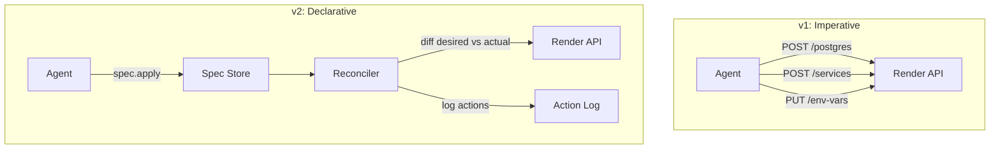
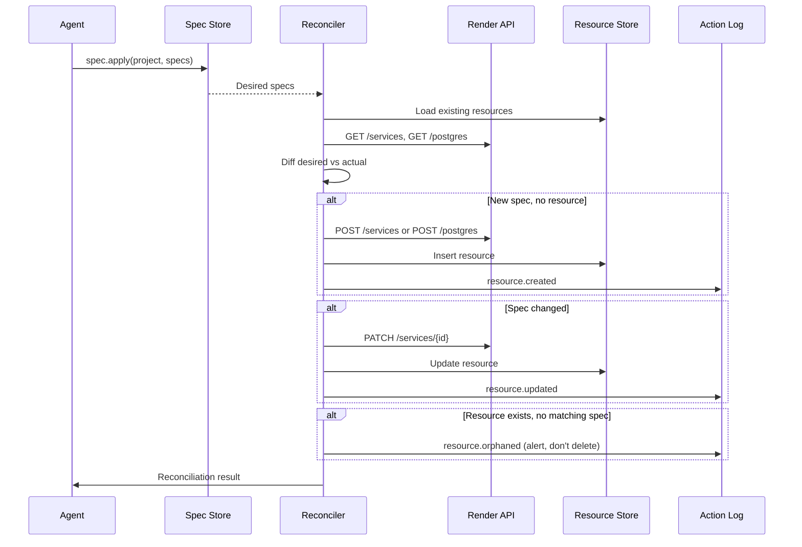

# v1 & v2: Implementation Plans

> v1: The agent can provision infrastructure. v2: The agent declares desired state and a reconciler converges.

*Previous: [v0 Implementation](./v0-implementation.md)*

---

## v1: The Agent Can Provision Infrastructure

v0 proved the deploy loop works against existing services. v1 is the leap to **greenfield**: the agent can create services and databases from scratch, wire them together, and deploy.

### What v1 Adds

**6 new tools (11 total):**

| Tool | Render API | Purpose |
|---|---|---|
| `render_create_service` | `POST /services` | Provision a new web service, worker, or cron job |
| `render_create_postgres` | `POST /postgres` | Provision a new Postgres instance |
| `render_create_redis` | `POST /redis` | Provision a new Redis instance |
| `render_get_postgres_connection` | `GET /postgres/{id}/connection-info` | Get the connection string |
| `render_list_postgres` | `GET /postgres` | List existing Postgres instances |
| `render_get_service` | `GET /services/{id}` | Get detailed info for a specific service |

### Cost Confirmation

No CostLedger abstraction — just a static price map and the existing `ask_user_question` tool:

```typescript
const RENDER_MONTHLY_COST_CENTS: Record<string, Record<string, number>> = {
  web_service: { free: 0, starter: 700, standard: 2500, pro: 8500 },
  background_worker: { free: 0, starter: 700, standard: 2500, pro: 8500 },
  postgres: { free: 0, starter: 700, basic_256mb: 700, basic_1gb: 2000, pro_4gb: 9700 },
  redis: { starter: 700, standard: 2500, pro: 8500 },
};
```

The system prompt instructs: "Before creating any Render resources, always estimate monthly cost and confirm with the user." Prompt-level guardrail, not code-level.

### Codebase Changes

**Extend `packages/render-client/`:**
- `client.ts` — add createService, createPostgres, createRedis, getPostgresConnectionInfo, listPostgres, getService
- `types.ts` — add CreateServiceParams, CreatePostgresParams, CreateRedisParams, ConnectionInfo, etc.
- `cost.ts` — NEW: static price map + estimateMonthlyCost() helper

**Extend `apps/agent/src/tools/render.ts`:**
- 6 new tool definitions
- `render_create_service` needs `ownerId` (from `RENDER_OWNER_ID` env var or `render_list_services`)

**New env var: `RENDER_OWNER_ID`** — workspace ID for resource creation

### The v1 Demo

```
User: "Build me a todo API with a Postgres database and deploy it"

Agent:
1. Estimates: Web Starter ($7/mo) + Postgres Basic-256MB ($7/mo) = $14/mo
2. Asks: "This will cost ~$14/month. Proceed?"
3. User confirms
4. Creates Postgres → gets connection string
5. Creates web service with DATABASE_URL set
6. Writes code, pushes, deploys
7. Returns: "Live at https://todo-api-xyz.onrender.com ($14/mo)"
```

### What v1 Does NOT Build

- No Spec/Resource abstraction (agent manages imperatively)
- No Connection model (agent wires DATABASE_URL manually)
- No reconciler, event store, environments, checkpoints

---

## v2: Declarative Infrastructure (Spec + Reconciler)

The shift from "do this now" to "this is what I need."

### The Core Shift



### New Abstractions

1. **Spec** — desired state for a resource (stored in Postgres)
2. **Resource** — actual state mirror of what's on Render (stored in Postgres)
3. **Action** — append-only log of everything the reconciler does

### Data Model

```sql
-- What SHOULD exist (desired state)
CREATE TABLE specs (
  id          TEXT PRIMARY KEY,
  project_id  TEXT NOT NULL,
  kind        TEXT NOT NULL,  -- 'web_service' | 'worker' | 'postgres' | 'redis'
  name        TEXT NOT NULL,
  desired     JSONB NOT NULL,
  version     INTEGER NOT NULL DEFAULT 1,
  created_by  TEXT,
  created_at  TIMESTAMPTZ DEFAULT now(),
  updated_at  TIMESTAMPTZ DEFAULT now(),
  UNIQUE(project_id, kind, name)
);

-- What DOES exist (actual state, synced from Render)
CREATE TABLE resources (
  id              TEXT PRIMARY KEY,
  project_id      TEXT NOT NULL,
  spec_id         TEXT REFERENCES specs(id),
  kind            TEXT NOT NULL,
  name            TEXT NOT NULL,
  external_id     TEXT NOT NULL,
  external_url    TEXT,
  internal_url    TEXT,
  status          TEXT NOT NULL,
  actual          JSONB NOT NULL,
  health_status   TEXT DEFAULT 'unknown',
  last_synced_at  TIMESTAMPTZ DEFAULT now(),
  created_at      TIMESTAMPTZ DEFAULT now()
);

-- What HAPPENED (append-only event log)
CREATE TABLE actions (
  id              TEXT PRIMARY KEY,
  project_id      TEXT NOT NULL,
  session_id      TEXT,
  sequence_num    BIGSERIAL,
  kind            TEXT NOT NULL,
  spec_id         TEXT,
  resource_id     TEXT,
  input           JSONB,
  output          JSONB,
  status          TEXT NOT NULL,
  error           TEXT,
  caused_by       TEXT,
  created_at      TIMESTAMPTZ DEFAULT now()
);
```

### The Reconciler

Called explicitly when the agent applies specs (not a background loop — that's v4).



### New Tools

| Tool | Replaces | What It Does |
|---|---|---|
| `render_apply_specs` | create_service, create_postgres, create_redis | Declare desired state, reconciler handles the rest |
| `render_project_status` | list_services + manual inspection | Full view: specs, resources, health, drift |
| `render_list_actions` | (new) | Query the action log |

v1 imperative tools remain as escape hatches.

### Codebase Structure

**New package: `packages/forge-core/`**

```
packages/forge-core/src/
  models/
    spec.ts            — Spec type + Zod schema
    resource.ts        — Resource type
    action.ts          — Action type
    connection.ts      — Connection template type
  reconciler/
    index.ts           — reconcile(specs, resources) -> actions
    diff.ts            — diffSpecs(desired, actual) -> changes
    apply.ts           — applyChange(change, renderClient) -> result
  cost/
    estimate.ts        — estimateCost(specs) -> CostEstimate
    pricing.ts         — static Render pricing data
```

### The v2 Demo

```
User: "Set up my app with a web service, Postgres, and Redis"

Agent:
1. Calls render_apply_specs with 3 specs + 2 connections
2. Reconciler: nothing exists -> creates all three
3. Wires DATABASE_URL and REDIS_URL automatically
4. Logs 5 actions
5. Reports: "Infrastructure created. Total: $21/mo"
6. Deploys -> live

User: (later) "Upgrade the database to pro"

Agent:
1. Calls render_apply_specs with updated postgres spec
2. Reconciler: only postgres changed -> patches it
3. Logs 1 action
4. Reports: "Database upgraded. New total: $111/mo (+$90/mo)"
```

### v1 vs v2 Comparison

| Dimension | v1 | v2 |
|---|---|---|
| **Mental model** | "Do this now" (imperative) | "This is what I need" (declarative) |
| **State tracking** | Agent remembers in context | Spec + Resource tables in Postgres |
| **Drift detection** | None | Reconciler compares spec vs actual |
| **Wiring** | Agent manually sets env vars | Connections auto-resolve |
| **History** | Session chat log | Structured action log |
| **Idempotency** | Agent must check before creating | Reconciler handles it |
| **New abstractions** | 0 (just more tools) | 3 (Spec, Resource, Action) |
| **Effort** | ~200 lines (6 tools + cost map) | ~800 lines (models, reconciler, migration, tools) |

---

*Document created: May 8, 2026*
*Previous: [v0 Implementation](./v0-implementation.md)*
*Next: v3-v5 plans*
